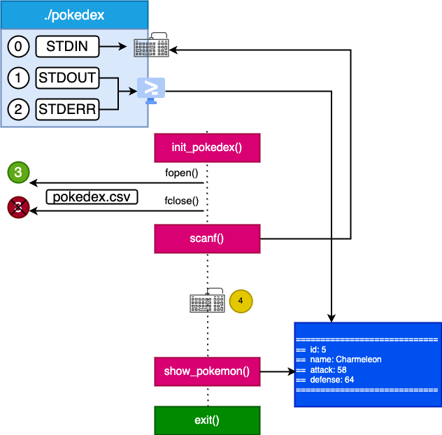
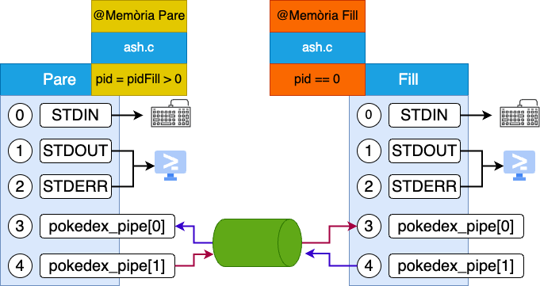
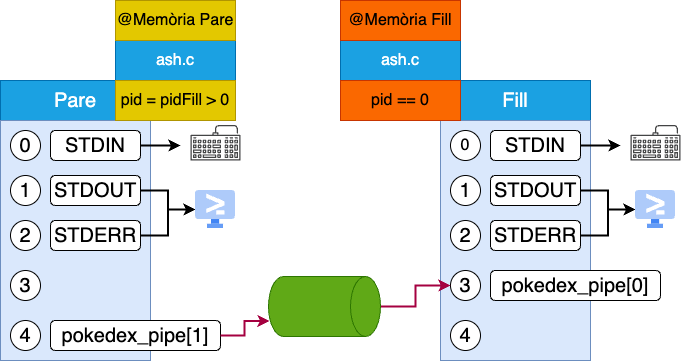
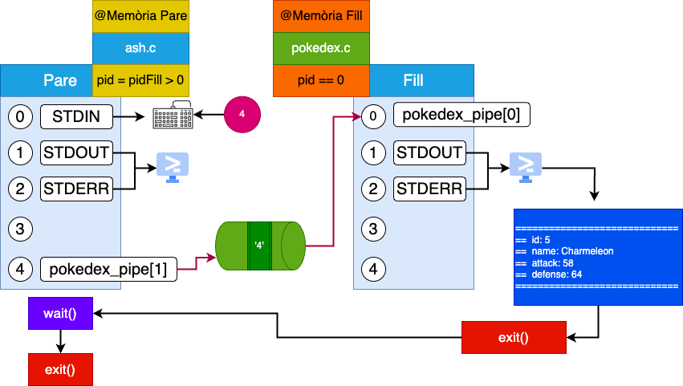
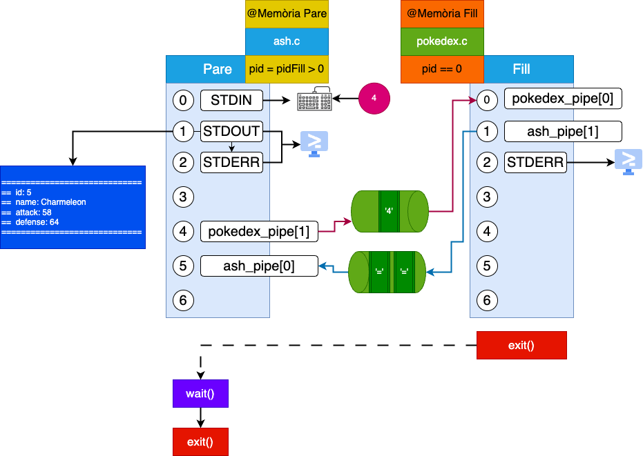
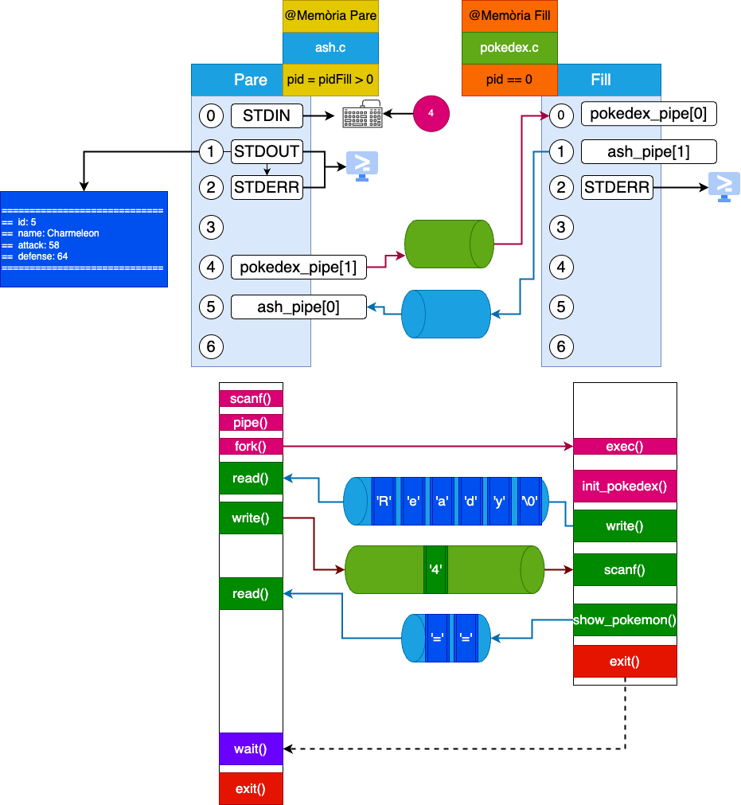

# Pokèdex

Volem crear un *sistema que simuli l’activitat d’una Pokèdex*. Imaginem que l’usuari, representat pel procés **pare Ash**, vol consultar informació sobre Pokèmons en qualsevol moment. Per aconseguir-ho, **Ash** crearà un procés fill anomenat **Pokèdex**.

* El programa *ash.c* permetrà a l’usuari introduir un pokemonId a través del teclat (stdin [0]). Es comprovarà que el pokemonId estigui en l’interval de 1 a 151, que correspon a la primera generació de Pokèmons. Un cop validat, aquest pokemonId serà enviat a través d’una canonada.

* La Pokèdex, representada pel programa *pokedex.c*, llegirà el **pokemonId** a través de la canonada i respondrà amb tota la informació relacionada amb aquest **Pokémon**. No obstant això, és important destacar que la **responsabilitat de mostrar aquesta informació** pertany al procés **Ash**, no a la **Pokedex**.

* Cal tenir en compte que cada vegada que el procés Ash necessiti consultar un nou Pokémon, es crearà un nou procés Pokedex que posteriorment es destruirà.

* Per carregar la informació dels Pokèmons a la memòria, utilitzarem el fitxer *pokedex.c* que conté el codi necessari per llegir la informació dels Pokèmons des de *pokedex.csv* i carregar-la a la memòria.

* No podem començar a treballar amb la Pokedex fins que el dispositiu estigui llest. Estarà llest quan el procés acaba de llegir a la memòria la informació de pokedex.csv.

## Resolució

### Pokedex

El primer que s'ha de tenir en compte es que l'enunciat ens proporciona 2 programes amb el seu ```main()``` ja implementat. Això implica que *ash.c* i *pokedex.c* poden actuar de forma independent, però que també poden interactuar entre ells. Per tant, el primer que farem serà preparar la *pokedex.c* perquè pugui actuar de forma autònoma.

Per fer-ho, farem que el procés esperi un valor enter per **stdin**[0], comprovi que el valor es troba dins del rang *0-150* i el passarem a la funció ```show_pokemon``` que ja teniu implementada i que mostra el resultat formatejat per **stdout**[1]. Observeu que show_pokemon utilitza la funció ```printf()``` per mostrar el resultat per pantalla.



La imatge anterior ens mostra com es comporta la Pokédex i quins descriptors de fitxers i dispositius utilitza. En primer lloc, la **Pokédex** carrega la informació des del fitxer *pokedex.csv* a la memòria. Per fer-ho, s'utilitza la funció ```fopen()``` per assignar el següent descriptor de fitxer disponible, en aquest cas el **3**, i s'utilitza aquest descriptor per llegir línia a línia ```fgets()``` el seu contingut. Posteriorment, es fa servir ```fclose()``` per desassignar el descriptor de fitxer i alliberar recursos. Un cop la informació està carregada, la **Pokédex** espera que l'usuari introdueixi un valor enter a través de **stdin**[0]. Quan rep aquest valor, comprova si es troba dins del rang de 0 a 150. Si està dins d'aquest rang, mostra el resultat per **stdout**[1] amb la funció ```printf()```. 

```c
/*
 * pokedex.c -> Als sources pokedex_v1.c
 */

int main(int argc, char** argv) {
    init_pokedex();

    int pokemonid;
    
    // El procés espera un valor enter per stdin
    scanf("%d", &pokemonid);

    // Comprovem que el valor es troba dins del rang 0-150
    if (pokemonid < 0 || pokemonid > 150) {
        printf("El valor %d no es troba dins del rang 0-150\n", pokemonid);
        exit(-1);
    }

    // Mostrem el resultat per stdout utilitzant la funció show_pokemon (ja implementada)
    show_pokemon(pokemonid);
    
    exit(0);
}
```


### Ash

Un cop la Pokédex és funcional per a utilització autònoma, el següent pas és implementar el procés **Ash**. Aquest procés serà capaç de crear un procés *fill* que executi la Pokédex i li enviï un valor enter a través de **stdin**. Farem servir la funció ```fork()``` per aconseguir això.

```c
/*
 * ash.c -> Als sources ash_v1.c
 */

pid_t pid = fork();
switch(pid){
    case -1:
        perror("fork");
        exit(-1);
        break;
    case 0:
        run_child(); // pokedex.c
        break;
    default:
        run_parent(); // ash.c
        break;
      }
   }
```

Un cop fet el fork l'estat del sistema serà el següent:


On els 2 procésos *pare* i *fill* comparteixen codi (**ash.c**) i tenen una *còpia exacta de les seves dades en direccions de memòria diferents*. També observeu que els 2 procesos tenen assignats els descriptors de fitxer 0, 1 i 2, que corresponen a stdin, stdout i stderr respectivament.

Ara necessitem que el procés fill executi el programa (*pokedex.c*) i que el procés pare li enviï un valor enter per *stdin*. Per fer-ho, utilitzarem la funció ```execlp()``` que ens permet executar un programa i passar-li els paràmetres que necessiti. Recordeu que la funció ```execlp()``` substitueix el codi del procés actual pel codi del nou programa que s'executa. Per tant, si la funció ```execlp()``` retorna, vol dir que ha fallat i que el procés actual no s'ha pogut substituir pel nou programa. En aquest cas, el procés actual serà el procés fill i per tant, ha de mostrar un missatge d'error i sortir. 

* El primer paràmetre de la funció ```execlp()``` és el **path** del programa que volem executar. En aquest cas, el programa es troba al directori actual, per tant, el path del programa és ```./pokedex```. S'ha de tenir prèviament compilat el programa *pokedex.c* i anomenar-lo *pokedex*.

* El segon paràmetre és el nom del programa que volem executar. En aquest cas, l'argument argv[0] del programa és *./pokedex*.

* La resta són els paràmetres que necessita el programa. En aquest cas, no necessita cap paràmetre més, per tant, el tercer paràmetre serà *NULL*. Sempre que s'utilitzi la funció ```execlp()``` s'ha de passar un paràmetre *NULL* al final.


```c 
/*
 * ash.c -> Als sources ash_v1.c
 */

run_child(){
   execlp("./pokedex", "./pokedex",NULL);          
   perror("execlp pokedex");
   exit(-1);
}
```


Un cop el procés fill ja s'ha substituit pel nou programa, necessitem definir una forma de comunicació entre els 2 processos. En aquest cas, utilitzarem una canonada (**pipe**) anomenada *pokedex_pipe* que ens permetrà enviar un valor enter des del procés pare al procés fill. Recordeu que la **pipe** s'ha de definir abans de fer el ```fork()```, ja que si no, el procés fill no tindrà accés a la **pipe**.

```c
/*
 * ash.c -> Als sources ash_v1.c
 */

int pokedex_pipe[2];
if (pipe(pokedex_pipe) == -1) {
    perror("pipe");
    exit(-1);
}
pid_t pid = fork();
switch(pid){
    case -1:
        perror("fork");
        exit(-1);
        break;
    case 0:
        run_child(); // pokedex.c
        break;
    default:
        run_parent(); // ash.c
        break;
      }
   }
```



Un cop la *pipe* està definida i compartida entre els 2 processos, s'ha de definir la direcció de la *pipe* per cada procés. Recordeu que les pipes són unidireccionals, per tant, cada procés només necessita un dels descriptors de la *pipe*. 





En aquest cas, el procés pare només escriurà a la *pipe*, per tant, no necessita el descriptor de lectura (*pokedex_pipe[0]*). Per altra banda, el procés fill només llegirà de la *pipe*, per tant, no necessita el descriptor d'escriptura (*pokedex_pipe[1]*).

```c
/*
 * ash.c -> Als sources ash_v1.c
 */

void run_parent(){
   close(pokedex_pipe[0]);
}

void run_child(){
   
   close(pokedex_pipe[1]);
   execlp("./pokedex", "./pokedex",NULL);          
   perror("execlp pokedex");
   exit(-1);
}
```

Pokèdex està preparada per rebre el valor a *stdin* i no a través de la *pipe*. Per tant, el procés fill modificarà la pipeline de *stdin* per la pipeline de la *pipe* que hem creat. Per fer-ho, utilitzarem la funció ```dup2()``` que ens permet duplicar un descriptor de fitxer. En aquest cas, volem duplicar el descriptor de lectura de la *pipe* (*pokedex_pipe[0]*) i substituir-lo pel descriptor de lectura de *stdin* (0). Un cop fet podem tancar la pipeline de la *pipe* ja que no la necessitem.

```c
/*
 * ash.c -> Als sources ash_v1.c
 */

void run_child(){
   dup2(pokedex_pipe[0], 0);
   close(pokedex_pipe[0]);
   close(pokedex_pipe[1]);
   execlp("./pokedex", "./pokedex",NULL);          
   perror("execlp pokedex");
   exit(-1);
}
```


En aquest punt el pare ja pot escriure un valor enter a la *pipe* i el fill ja pot llegir-lo a través de *stdin*. 

```c
/*
 * ash.c -> Als sources ash_v1.c
 */

int pokemonid;

printf("Introdueix un pokemonId: ");
scanf("%d", &pokemonid);

// Comprovem que el valor es troba dins del rang 0-150
if (pokemonid < 0 || pokemonid > 150) {
    printf("El valor %d no es troba dins del rang 0-150\n", pokemonid);
    exit(-1);
}

write(pokedex_pipe[1], &pokemonid, sizeof(int));

// Esperem que el fill acabi
wait(NULL);
```

Per escriure s'ha utiltizar la instrucció ```write``` on el primer paràmetre és el descriptor de fitxer de la *pipe* (*pokedex_pipe[1]*), el segon paràmetre és el valor que volem escriure (*&pokemonid*) i el tercer paràmetre és la mida del valor que volem escriure (*sizeof(int)*). Finalment, el pare espera que el fill acabi per evitar que el procés pare acabi abans que el procés fill. En aquest moment, el fill hauria de mostrar per pantalla la informació del pokèmon que li ha enviat el pare.

> Si executeu **ash.c** observareu que la informació que ens mostra sempre és l'index 0 independement de quin valor agafi el pare. Això es degut al ```scanf``` del fill i al ```write``` del pare. La funció ```scanf```
espera la lectura d'un valor amb el format ```char *``` i el transforma a int amb **%d** per guardar-lo a la variable *pokemonid*. Per altra banda, la funció ```write``` escriu el valor a la canonada com un **int**. Per tant, el format de lectura i escriptura no coincideix. Per solucionar-ho podem enviar des de el pare el valor de la variable *pokemonid* en format ```char *```. 

```c
/*
 * ash.c -> Als sources ash_v1.c
 */
//(Show bug)
//int pokemonid; 
//(Correct bug)
char pokemonid_str[5];

...

printf("Introdueix un pokemonId: ");
//(Show bug)
//scanf("%d", &pokemonid);
//(Correct bug)
scanf("%s", pokemonid_str);

... 

void run_parent(){
   close(pokedex_pipe[0]);
   //(Show bug)
   //write(pokedex_pipe[1], &pokemonid, sizeof(int));
   //(Correct bug)
   write(pokedex_pipe[1], pokemonid_str, sizeof(pokemonid_str));

   // Esperem que el fill acabi.
   wait(NULL);
}
```



### Ash ha de ser l'encarregat de mostrar la informació

L'enunciat ens indica que el procés **ash** té la responsabilitat de mostrar la informació a *stdout*. Per aconseguir això, necessitem establir una nova ```pipe()``` que permeti enviar la informació des del procés *fill* (Pokédex) al procés *pare* (Ash), anomenada **ash_pipe**. 

D'igual manera que en l'exemple anterior, definirem aquesta pipe abans de fer la crida a ```fork()```, assegurant que estigui disponible per als dos processos resultants. La pipe serà compartida entre aquests dos processos per permetre la comunicació.

Pel que fa al procés Pokédex, que originalment estava configurat per utilitzar **stdout** per mostrar la informació, caldrà realitzar modificacions perquè utilitzi la *pipe* que hem creat, garantint que la sortida es redirigeixi correctament al procés pare (**Ash**).


```c
/*
 * ash.c -> Als sources ash_v2.c
 */

int ash_pipe[2];
if (pipe(ash_pipe) == -1) {
    perror("ash_pipe");
    exit(-1);
}

...

void run_parent(){

   close(pokedex_pipe[0]);
   close(ash_pipe[1]);

   write(pokedex_pipe[1], pokemonid_str, sizeof(pokemonid_str));

   char msg_pokedex[1000];
   read(ash_pipe[0],msg_pokedex, sizeof(msg_pokedex));
   printf("[ASH]: %s\n",msg_pokedex); 

   // Esperem que el fill (pokedex_v1 acabi)
   int id = wait(NULL);
   printf("%d \n",id);
}

void run_child(){
    dup2(pokedex_pipe[0], 0);
    close(pokedex_pipe[0]);
    close(pokedex_pipe[1]);
    
    dup2(ash_pipe[1], 1);
    close(ash_pipe[0]);
    close(ash_pipe[1]);
    
    execlp("./pokedex_v1", "./pokedex_v1",NULL);          
    perror("execlp pokedex");
    exit(-1);
}
```



> **OBSERVACIONS**: En aquesta implementació es pot donar el cas que el procés fill (**pokédex**) acabi abans que el pare (**ash**). En aquesta situació no hi ha cap problema, ja que el pare pot recollir la informació de la **pipe** fins que aquesta estigui buida. Això assegura que el pare rebrà tota la informació que el *fill* ha escrit abans de sortir, independentment del moment en què el *fill* hagi escrit i acabat. 

La funció ```wait()``` només bloqueja si el *fill* encara està en execució quan arriba a aquest punt. Si el *fill* ja ha acabat, ```wait()``` retorna immediatament i permet al pare continuar la seva execució. Això no afectarà la recepció de la informació de la pipe per part del pare. El fill deixa a la taula de processos del sistema la seva informació i el pare pot recollir-la quan vulgui, observeu el valor de l'últim printf() conté el **pid** del fill que ha acabat. Per tant, tampoc es produeix un *zombie*. 


### Ash ha de d'esperar que la pokèdex estigui llesta

L'enunciat ens detalla que la **Pokédex** no pot iniciar el seu funcionament fins que hagi llegit tota la informació del fitxer *pokedex.csv*. Per tant, el procés **Ash** ha de mantenir-se en espera fins que la Pokédex estigui totalment preparada per a la seva funcionalitat. Per aconseguir això, hi ha diferents opcions. Una opció és que el procés **Ash** esperi fins que la Pokédex li enviï un missatge quan estigui llesta.

Aprofitarem la *ash_pipe* que ja tenim definida i compartida entre els dos processos per aquesta finalitat.

```c

/*
 * pokedex.c -> Als sources pokdex_v2.c
 */

int main(int argc, char** argv) {
    init_pokedex();

    printf("READY");fflush(stdout);
    int pokemonid;
    
    // El procés espera un valor enter per stdin
    scanf("%d", &pokemonid);

    // Comprovem que el valor es troba dins del rang 0-150
    if (pokemonid < 0 || pokemonid > 150) {
        printf("El valor %d no es troba dins del rang 0-150\n", pokemonid);
        exit(-1);
    }

    // Mostrem el resultat per stdout utilitzant la funció show_pokemon (ja implementada)
    show_pokemon(pokemonid);
 
    exit(0);
}
```

```c
/*
 * ash.c -> Als sources ash_v3.c
 */
void run_parent(){
   close(pokedex_pipe[0]);
   close(ash_pipe[1]);

   // Esperarem el missatge 
   char ready_msg[6];
   read(ash_pipe[0],ready_msg, 6 * sizeof(char));
   printf("[ASH]: %s\n",ready_msg); fflush(stdout);

   write(pokedex_pipe[1], pokemonid_str, sizeof(pokemonid_str));
   
   char msg_pokedex[1000];
   read(ash_pipe[0],msg_pokedex, sizeof(msg_pokedex));
   printf("[ASH]: %s\n",msg_pokedex); 

   // Esperem que el fill (pokedex_v1 acabi)
   int id = wait(NULL);
   printf("%d \n",id);
}
```

Les úniques modificacions que s'han hagut de fer són: 
1. Enviar el missatge *READY* a través de la *ash_pipe* abans de llegir el valor enter per *stdin*. S'utilitza ```fflush(stdout)``` per assegurar que el buffer de sortida s'ha buidat abans de continuar.
2. Esperar a rebre el missatge *READY* a través de la *ash_pipe* abans d'enviar el valor enter a la *pokedex_pipe*. Fixeu-vos que **READY\0** són 5 caràcters, però s'ha de reservar un espai per al caràcter de final de cadena **\0**. Per tant, s'ha de reservar un espai de 6 caràcters.

> Aqui estem assumint que sempre s'enviarà **READY** estaria bé revisar que el missatge que rebem és el que esperem.




### Sincrònització amb senyals

Revisem les slides per comprendre com sincronitzar processos amb senyals. En aquest escenari, el procés pare ha d'esperar fins que el procés fill li envii el missatge "Ready". Modificarem la solució perquè el procés pare quedi bloquejat fins que rebi la senyal *SIGUSR1* que li enviarà el procés fill quan estigui llest.

```c
/*
 * pokedex.c -> Als sources pokdex_v3.c
 */
 #include <signal.h>
 ...
 int main(int argc, char** argv) {
    init_pokedex();

    //printf("READY");fflush(stdout);
    kill(getppid(), SIGUSR1);
    int pokemonid;
    
    // El procés espera un valor enter per stdin
    scanf("%d", &pokemonid);

    // Comprovem que el valor es troba dins del rang 0-150
    if (pokemonid < 0 || pokemonid > 150) {
        printf("El valor %d no es troba dins del rang 0-150\n", pokemonid);
        exit(-1);
    }

    // Mostrem el resultat per stdout utilitzant la funció show_pokemon (ja implementada)
    show_pokemon(pokemonid);
 
    exit(0);
}
```

El procés fill enviarà al seu procés pare la senyal **SIGUSR1** indicant que ja està preparat. La funció ```getppid()``` retorna el pid del procés pare. 

```c
/*
 * ash.c -> Als sources ash_v4.c
 */
#include <signal.h>

void handler(int signum);
...
int waiting = 0;
void handler(int signum){
    if (signum == SIGUSR1){
        printf("[ASH]: READY\n");
        waiting = 1;
    }
}

int main(int argc, char *argv[])
{
    signal(SIGUSR1, handler);
    ...
}

void run_parent(){
   close(pokedex_pipe[0]);
   close(ash_pipe[1]);

   // Esperarem el missatge 
   //char ready_msg[6];
   //read(ash_pipe[0],ready_msg, 6 * sizeof(char));
   //printf("[ASH]: %s\n",ready_msg); fflush(stdout);
   while(waiting!=0){};
   write(pokedex_pipe[1], pokemonid_str, sizeof(pokemonid_str));
   
   char msg_pokedex[1000];
   read(ash_pipe[0],msg_pokedex, sizeof(msg_pokedex));
   printf("[ASH]: %s\n",msg_pokedex); 

   // Esperem que el fill (pokedex_v1 acabi)
   int id = wait(NULL);
   printf("%d \n",id);
}
```

En el cas del pare **ash** únicament s'ha d'indicar al procés com actuar en cas de la recepció de la senyal **SIGUSR1**. Per fer-ho, s'utilitza la funció ```signal()``` que rep com a paràmetres el tipus de senyal que volem capturar i la funció que s'ha d'executar quan es rep la senyal. En aquest cas, la funció ```handler()``` que hem definit anteriorment. El ```handler``` assegurem que la senyal rebuda siguin **SIGUSR1** i mostrem el missatge *READY*. A més, modifiquem la variable *waiting* per indicar que ja podem continuar amb l'execució del pare.

> **OBSERVACIÓ 1**. Al fer la comprovació al handler poder reutilitzar-lo amb diferents casos. Per exemple, si el pare rep la senyal **SIGUSR2** pot mostrar un altre missatge i fer una altra acció.

> **OBSERVACIÓ 2**. Recordeu d'incloure la llibreria ```#include <signal.h>```.


> **OBSERVACIÓ 3**.  A la nostra implementació el pare defineix el tractament del senyal *SIGUSR1* abans de fer el ```fork()``` per tant pare i fill comparteixen aquest tractament. Ara bé, com que el fill fa un recobriment ```exec()``` aquest tractament **també es perd**.

>  **OBSERVACIÓ 4**. Observeu que fins que el pari no rep la senyal *SIGUSR1* del fill no podrà continuar amb la seva execució. Per tant, si el fill no envia la senyal el pare quedarà bloquejat indefinidament. Per evitar aquesta situació, el pare pot definir un *timeout* per esperar la senyal. Si el pare no rep la senyal en un temps determinat, pot mostrar un missatge d'error i sortir. Per fer-ho, el pare ha de definir un *handler* per la senyal **SIGALRM** i utilitzar la funció ```alarm()``` per definir el temps d'espera.


## Repte: Pokèdex amb FIFOs

Volem millorar la nostra **Pokedex** perquè funcioni com un servei en un bucle infinit, gestionant les peticions d'índex de Pokémon rebudes a través d'un FIFO. 

* La **Pokedex** restarà a la espera de qualsevol valor que arribi a través del FIFO. Quan rebi un valor, mostrarà la informació del Pokémon corresponent a l'índex rebut.

* La **Pokedex** finalitzarà quan rebi la senyal **SIGUSR1**.

* La **Pokedex** no acabarà amb la senyal **SIGINT** (ctrl+c).

```c
/*
 * pokedex.c -> Als sources pokedex_v4.c
 */
#include <stdio.h>
#include <stdlib.h>
#include <unistd.h>
#include <sys/types.h>
#include <sys/stat.h>
#include <fcntl.h>
#include <string.h>
#include <time.h>
#include <signal.h>

#include "pokemon.h"
struct pokemon pokedex[POKEMONS];

#define FIFO_NAME "pokemon_fifo"

int running = 0;
int fifo_fd = 0;

void show_pokemon(int position);
void init_pokedex(void);
void handler(int signum);

void handler(int signum){
    if (signum == SIGUSR1){
        printf("[Pokedex]: Ending...\n");
        running = 1;
        fflush(stdout);
        close(fifo_fd);
    }
}


int main(int argc, char** argv) {

    signal(SIGINT, SIG_IGN);
    signal(SIGUSR1, handler);
    init_pokedex();

    if (mkfifo(FIFO_NAME, 0666) == -1) {
        perror("mkfifo");
        exit(EXIT_FAILURE);
    }

     while (running==0) {

        fifo_fd = open(FIFO_NAME, O_RDONLY);
        if (fifo_fd == -1) {
            perror("open fifo");
            exit(EXIT_FAILURE);
        }
        
        char pokemon_str[5];
        int pokemonid = -1;
        
        read(fifo_fd, pokemon_str, sizeof(pokemon_str));
        pokemonid = atoi(pokemon_str);

        if (pokemonid < 0 || pokemonid > 150) {
            printf("El valor %d no es troba dins del rang 0-150\n", pokemonid);
            exit(-1);
        }

        show_pokemon(pokemonid); 
        close(fifo_fd);
     }
 
    exit(0);
}
```

Per fer servir aquesta versió de la pokedex, cal utilitzar 2 terminals diferents. En un terminal s'executarà el procés **Pokèdex** i des de l'altre terminal li enviarem informació.

**Terminal 1**
```bash
$ ./pokedex_v4
```

**Terminal 2**
```bash
echo -n "4" > pokemon_fifo
echo -n "145" > pokemon_fifo
echo "15" > pokemon_fifo
```

Com podeu observar a la **Terminal 1**, la pokedex es queda esperant a rebre informació a través del FIFO. A la **Terminal 2**, enviem 3 valors a la pokedex. ```echo -n "4" > pokemon_fifo``` envia el valor "4" a stdout que es redirigeix al FIFO. L'argument ```-n``` de la comanda ```echo``` evita que s'afegeixi un salt de línia al final del valor enviat.

El primer valor enviat és 4, per tant, la pokedex ens mostrarà la informació del pokèmon amb index 4. El segon valor és 145, per tant, la pokedex ens mostrarà la informació del pokèmon amb index 145. El tercer valor és 15, per tant, la pokedex ens mostrarà la informació del pokèmon amb index 15.

Recordeu que no podeu matar el procés de la terminal 1 amb **ctrl+c**. Per matar-lo, heu d'enviar-li la senyal **SIGUSR1**. Per fer-ho, podeu utilitzar la comanda ```kill``` o ```pkill```.

1. Obtenim el pid del procés:
    ```bash
    ps -ax | grep pokedex
    1161 pts/4    S+     0:00 ./pokedex_v4
    1168 pts/5    S+     0:00 grep pokedex
    ```

2. Enviem la senyal SIGUSR1 al procés:
    ```bash
    # en el meu cas 1161 en el vostre pot ser diferent
    kill -SIGUSR1 1161
    ```

3. Eliminem el FIFO:
    ```bash
    rm -rf pokemon_fifo
    ```

> **OBSERVACIÓ**. Si voleu que al tancar la pokedex es destrueixi el FIFO, podeu afegir el següent codi: ```unlink(FIFO_NAME);```. Això eliminarà el FIFO abans d'acabar el procés.
