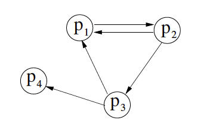

# Interbloqueix (Deadlocks)

Un **interbloqueig** és una situació en la qual dos o més processos queden bloquejats. Cada un d'ells espera que l'altre acabi la seva tasca per poder continuar. Aquesta situació pot ser causada per l'ús de recursos compartits.

Un sistema conté 2 processos (**A i B**). Hi ha *tres recursos **R1***. Cada procés necessita un màxim de 2 recursos R1. Es possible un interbloqueig en aquesta situació? Raoneu la resposta.

<details>
<summary>Veure la resposta</summary>

En aquesta situació no es possible un interbloqueig. El procés A necessita 2 recursos R1 per a continuar. El procés B necessita 2 recursos R1 per a continuar. Com que hi ha 3 recursos R1, un dels processos pot continuar i desbloquejar l'altre procés.
</details>

## Condicions necessàries

Per a que es produeixi un interbloqueig, es necessari que es compleixin les següents condicions:

1. **Exclusió mútua**: almenys un recurs ha de ser no compartible. Això vol dir que només un procés pot utilitzar el recurs alhora.
2. **Retenció i espera**: almenys un procés ha de mantenir un recurs mentre espera per a un altre recurs.
3. **No apropiació**: els recursos no poden ser trets als processos involuntàriament.
4. **Espera circular**: ha de formar-se un cicle de processos on cada procés està esperant un recurs que està sent utilitzat pel següent procés del cicle.

Les 4 condicions anteriors són necessàries per a que es produeixi un interbloqueig. Pensa una situació que demostri que aquestes condicions no són suficients per a que es produeixi un interbloqueig. Quan són aquestes condicions suficients per a que es produeixi un interbloqueig?

Imagina tres processos **A,B,C** i dos recursos **R1 (1)**  i **R2 (2)**.

- A soilicita 1 instancia de R1 i el sistema operatiu li condedeix.
- B sol·licita 1 instancia de R2 i el sistema operatiu li concedeix.
- C sol·licita 1 instancia de R2 i el sistema operatiu li concedeix.
- B sol·licita 1 instancia de R1 i el sistema operatiu li bloqueja.
- A sol·licita 1 instancia de R2 i el sistema operatiu li bloqueja.

En aquest punt es compleixen les 4 condicions però no hi ha interbloqueig. Quan C acabi, es desbloquejarà B i aquest podrà acabar la seva execució. Quan B acabi, es desbloquejarà A i aquest podrà acabar la seva execució. Per tant, les 4 condicions són suficients si hi ha un recurs de cada tipus.

Pots imaginar un sistema on es compleixin les condicions 1, 2 i 3 però no es produeixi un interbloqueig? Raoneu la resposta.

<details>
<summary>Veure la resposta</summary>

En un sistema amb 1 recurs (no apropiatiu) i 2 processos. Es pot complir la condició 1, el recurs serà utilitzat per un procés i l'altre procés haurà d'esperar. Es pot complir la condició 2, el procés que utilitza el recurs no el deixarà fins que acabi. Es compleix la condició 3 simplement per fer servir un recurs no apropiatiu. Però si el procés A no necessita el recurs i únicament el necessita el procés B no hi haurà espera circular. Per tant, no es produirà un interbloqueig.
</details>

Es possible un interbloqueig amb processos que no estan involucrats en el cicle de processos que esperen recursos? Raoneu la resposta i doneu un exemple.

<details>
<summary>Veure la resposta</summary>

Si, es possible. Per exemple, si tenim 3 processos A, B i C i 2 recursos R1 i R2. A espera R1 que el té B, B espera R2 que el té A i C espera per R2 que el té A. En aquest cas, C no està involucrat en el cicle de processos que esperen recursos però hi ha un interbloqueig.
</details>

## Evitació

Per evitar interbloquejos, es pot utilitzar un algorisme que asseguri que les condicions necessàries per a que es produeixi un interbloqueig no es compleixin.

- L'algorisme del banquer és un algorisme que assegura que no es produeixi un interbloqueig. Aquest algorisme es basa en el fet que si un procés no pot obtenir tots els recursos que necessita, llavors no els obtindrà mai.

  1. **Si**: -> \\( Sol·licitud_i \leq Necessitat_i\\) anar a 2. **Sinó** error
  2. **Si**: -> \\( Sol·licitud_i \leq Disponible_i\\) anar a 3. **Sinó** espera
  3. **Actualizar**:
     - \\(Disponible_i =  Disponible_i - Sol·licitud_i\\)
     - \\( Assignat_i = Assignat_i + Sol·licitud_i\\)
     - \\( Necessitat_i = Necessitat_i - Sol·licitud_i\\)

- L'algorisme de seguretat és un algorisme que assegura que no es produeixi un interbloqueig. Aquest algorisme es basa en el fet que si un procés pot obtenir tots els recursos que necessita, llavors el sistema es troba en un estat segur.

  1. Inicialització:
     - \\(Treball = Disponible\\)
     - \\(Fet_i = 0; \forall i \in  [1 \ldots n]\\).
  2. **SI** -> \\( \nexists i : ( Fet_i=0 \land Necessitat_i \leq Treball)  \\) anar a 4.
  3. Actualitzar i anar a 2:
      - Treball = Treball + Assignat_i
      - Fet_i = 1
  4. **SI** -> \\( Fet_i = 1 : \forall i \in  [1 \ldots n] \\) el sistema es troba en un estat segur.

La combinació de l'algorisme del banquer i l'algorisme de seguretat és un algorisme que assegura que no es produeixi un interbloqueig. Aquest algorisme es basa en el fet que si un procés no pot obtenir tots els recursos que necessita, llavors no els obtindrà mai. I si un procés pot obtenir tots els recursos que necessita, llavors el sistema es troba en un estat segur.

### Problema 1: Anàlisi d'un sistema

Assumirem un sistema amb 5 processos \\( p_0, p_1, p_2, p_3, p_4\\) i 3 tipus de recursos \\(r_{0},r_{1},r_{2}\\). Donat l'estat inicial del sistema, volem saber si el sistema concediria la següent sol·licitud \\( Sol·licitud_{1}(1,0,2)\\)? Raoneu la resposta assumint que el sistema utilitza l'algorisme del banquer i l'algorisme de seguretat.

\\[
\begin{gathered}
\text{Assignat} =
\begin{bmatrix}
0 & 1 & 0 \\\\
2 & 0 & 0 \\\\
3 & 0 & 2 \\\\
2 & 1 & 1 \\\\
0 & 0 & 2
\end{bmatrix}
\text{   Necessitat} =
\begin{bmatrix}
7 & 4 & 3 \\\\
1 & 2 & 2 \\\\
6 & 0 & 0 \\\\
0 & 1 & 1 \\\\
4 & 3 & 1
\end{bmatrix}
\text{   Disponible} =
\begin{bmatrix}
3 & 3 & 2
\end{bmatrix}
\end{gathered}
\\]

Per resoldre aquest problema, primer hem de veure si estem en un estat segur.

1. Sol·licitem el recurs \\( Sol·licitud_{1}(1,0,2)\\)
2. \\( Sol·licitud_{1}(1,0,2) \leq Necessitat_{1}(0,2,0)\\) -> Si
3. \\( Sol·licitud_{1}(1,0,2) \leq Disponible(3,3,2)\\) -> Si
4. Actualitzem:
   - \\(Disponible =  Disponible - Sol·licitud_{1}(1,0,2) = (2,3,0)\\)
   - \\( Assignat_{1} = Assignat_{1} + Sol·licitud_{1}(1,0,2) = (3,0,2)\\)
   - \\( Necessitat_{1} = Necessitat_{1} - Sol·licitud_{1}(1,0,2) = (0,2,0)\\)

L'estat resultat és:

\\[ 
\begin{gathered}
\text{Assignat} =
\begin{bmatrix}
0 & 1 & 0 \\\\
3 & 0 & 2 \\\\
3 & 0 & 2 \\\\
2 & 1 & 1 \\\\
0 & 0 & 2
\end{bmatrix}
\text{   Necessitat} =
\begin{bmatrix}
7 & 4 & 3 \\\\
0 & 2 & 0 \\\\
6 & 0 & 0 \\\\
0 & 1 & 1 \\\\
4 & 3 & 1
\end{bmatrix}
\text{   Disponible} =
\begin{bmatrix}
2 & 3 & 0
\end{bmatrix}
\end{gathered}
\\]


Apliquem l'algorisme de seguretat:

- Inicialització:
  - Treball = Disponible = [2,3,0]
  - Fet = [0,0,0,0,0]
  
- Iteració 1:
  - **Seleccionem P1**.
  - **Assignats:** \\([3, 0, 2]\\)
  - **Treball:** \\([2, 3, 0]\\)
  - **Treball (suma)**:

    \\[
        \begin{bmatrix}
        3 & 0 & 2
        \end{bmatrix}
        +
        \begin{bmatrix}
        2 & 3 & 0
        \end{bmatrix}
        =
        \begin{bmatrix}
            5 & 3 & 2
        \end{bmatrix}
    \\]

  - **Fet:** \\([0, 1, 0, 0, 0]\\)

- Iteració 2:
  - **Seleccionem P3**.
  - **Assignats:** \\([2, 1, 1]\\)
  - **Treball:** \\([5, 3, 2]\\)
  - **Treball (suma)**:

    \\[
        \begin{bmatrix}
        2 & 1 & 1
        \end{bmatrix}
        +
        \begin{bmatrix}
        5 & 3 & 2
        \end{bmatrix}
        =
        \begin{bmatrix}
            7 & 4 & 3
        \end{bmatrix}
    \\]

  - **Fet:** \\([0, 1, 0, 1, 0]\\)

- Iteració 3:
  - **Seleccionem P0**.
  - **Assignats:** \\([0, 1, 0]\\)
  - **Treball:** \\([7, 4, 3]\\)
  - **Treball (suma)**:

    \\[
        \begin{bmatrix}
        0 & 1 & 0
        \end{bmatrix}
        +
        \begin{bmatrix}
        7 & 4 & 3
        \end{bmatrix}
        =
        \begin{bmatrix}
            7 & 5 & 3
        \end{bmatrix}
    \\]

  - **Fet:** \\([1, 1, 0, 1, 0]\\)

- Iteració 4:
  - **Seleccionem P2**.
  - **Assignats:** \\([3, 0, 2]\\)
  - **Treball:** \\([7, 5, 3]\\)
  - **Treball (suma)**:

    \\[
        \begin{bmatrix}
        3 & 0 & 2
        \end{bmatrix}
        +
        \begin{bmatrix}
        7 & 5 & 3
        \end{bmatrix}
        =
        \begin{bmatrix}
            10 & 5 & 5
        \end{bmatrix}
    \\]

  - **Fet:** \\([1, 1, 1, 1, 0]\\)

- Iteració 5:
  - **Seleccionem P4**.
  - **Assignats:** \\([0, 0, 2]\\)
  - **Treball:** \\([10, 5, 5]\\)
  - **Treball (suma)**:

    \\[
        \begin{bmatrix}
        0 & 0 & 2
        \end{bmatrix}
        +
        \begin{bmatrix}
        10 & 5 & 5
        \end{bmatrix}
        =
        \begin{bmatrix}
            10 & 5 & 7
        \end{bmatrix}
    \\]

  - **Fet:** \\([1, 1, 1, 1, 1]\\)

A l'aplicar l'algorisme de seguretat, hem trobat una seqüencia segura. Per tant, el sistema es troba en un estat segur. En aquest cas, el sistema serviria la petició del procés \\( Sol·licitud_{1}(1,0,2)\\).

#### Implementació

Volem implementar un programa que utilitzi l'algorisme del banquer i l'algorisme de seguretat per a comprovar si un sistema es troba en un estat segur i per a servir sol·licituds de recursos. Per a fer-ho, utilitzarem les següents estructures de dades:

- **Assignat**: Matriu que representa els recursos assignats a cada procés.
- **Necessitat**: Matriu que representa els recursos que necessita cada procés.
- **Disponible**: Vector que representa els recursos disponibles.
- **Sol·licitud**: Vector que representa els recursos que sol·licita un procés.
- **Fet**: Vector que representa si un procés ha acabat.

```c
int Assignat[MAX_PROCESOS][MAX_RECURSOS];
int Necessitat[MAX_PROCESOS][MAX_RECURSOS];
int Disponible[MAX_RECURSOS];
int Sol·licitud[MAX_RECURSOS];
int Fet[MAX_PROCESOS];
```

El primer pas per utilitzar l'algorisme del banquer es comparar dos vectors (per exemple, la sol·licitud i la necessitat). Per a comparar dos vectors, necessitem implementar una funció `compararVectors`. Aquesta funció rep com a paràmetres dos vectors i la seva longitud. Finalment, ens retorna:

- -1 si el primer vector és menor que el segon.
- 1 si el primer vector és major que el segon.
- 0 si els vectors són iguals.

```c
int compararVectors(int vector1[], int vector2[], int longitud) {
    for (int i = 0; i < longitud; i++) {
        switch (vector1[i] - vector2[i]) {
            case -1:
                return -1;  // vector1 és menor que vector2
            case 1:
                return 1;   // vector1 és major que vector2
        }
    }
    return 0;  // Vectors són iguals
}
```

El segon pas per utilitzar l'algorisme del banquer es actualitzar les estructures. Per a actualitzar les estructures, necessitem implementar una funció per sumar i restar vectors. Aquesta funció rep com a paràmetres dos vectors, la seva longitud i la operació a realitzar. Finalment, ens retorna el primer vector amb els valors actualitzats.

```c
void actualitzarVectors(int vector1[], int vector2[], int longitud, char operacio) {
  for (int i = 0; i < longitud; i++) {
    switch (operacio) {
      case '+':
        vector1[i] += vector2[i];
        break;
      case '-':
        vector1[i] -= vector2[i];
        break;
    }
  }
}
```

Ara ja tenim les funcions necessaries per implementar l'algorisme del banquer. Aquest algorisme rep com a paràmetres el número del procés que fa la sol·licitud i la sol·licitud. Aquest algorisme comprova si la sol·licitud és menor o igual a la necessitat i si la sol·licitud és menor o igual als recursos disponibles. Si es compleixen aquestes dues condicions, actualitza les estructures. En cas contrari, mostra un missatge d'error.

```c
void banquer(int proces, int Solicitud[MAX_RECURSOS]) {
    // Verificar si la solicitud és menor o igual a la Necessitat
    if (compararVectors(Solicitud, Necessitat[proces], MAX_RECURSOS) <= 0) {
        // Verificar si la solicitud és menor o igual als recursos disponibles
        if (compararVectors(Solicitud, Disponible, MAX_RECURSOS) <= 0) {
            // Actualitzar les estructures
            actualitzarVectors(Disponible, Solicitud, MAX_RECURSOS, '-');
            actualitzarVectors(Assignat[proces], Solicitud, MAX_RECURSOS, '+');
            actualitzarVectors(Necessitat[proces], Solicitud, MAX_RECURSOS, '-');
        } else {
            // Error: No hi ha prou recursos disponibles
            printf("Error: No hi ha prou recursos disponibles.\n");
        }
    } else {
        // Error: La sol·licitud supera la Necessitat
        printf("Error: La sol·licitud supera la Necessitat.\n");
    }
}
```

Per utilitzar l'algorisme de seguretat necessitem una funció que permeti copiar al vector treball el contingut del vector disponible. Per fer-ho podem modificar la funció `actualitzarVectors` per a que copiï el contingut d'un vector a un altre quant no li passem cap operació.

```c
void actualitzarVectors(int vector1[], int vector2[], int longitud, char operacio) {
  for (int i = 0; i < longitud; i++) {
    switch (operacio) {
      case '+':
        vector1[i] += vector2[i];
        break;
      case '-':
        vector1[i] -= vector2[i];
        break;
      default:
        vector1[i] = vector2[i];
        break;
    }
  }
}
```

Finalment, per a utilitzar l'algorisme de seguretat necessitem una funció que ens digui si el sistema es troba en un estat segur. Aquesta funció rep com a paràmetres el vector treball i la matriu necessitat. Finalment, ens retorna:

- 1 si el sistema es troba en un estat segur.
- 0 si el sistema no es troba en un estat segur.

```c
int estatSegur(int treball[], int necessitat[][MAX_RECURSOS]) {
    for (int i = 0; i < MAX_PROCESOS; i++) {
        if (Fet[i] == 0 && compararVectors(necessitat[i], treball, MAX_RECURSOS) <= 0) {
            return 0;
        }
    }
    return 1;
}
```

Ara ja tenim les funcions necessaries per implementar l'algorisme de seguretat. Aquest algorisme rep com a paràmetres el vector treball i la matriu necessitat. Aquest algorisme comprova si tots els processos estan compleats i si el sistema es troba en un estat segur. En cas contrari, mostra un missatge d'error.

```c
int seguretat() {
    int Treball[MAX_RECURSOS];
    actualitzarVectors(Treball, Disponible, MAX_RECURSOS, '+');
    
    for (int i = 0; i < MAX_PROCESOS; i++) {
        Fet[i] = 0;
    }

    for (int i = 0; i < MAX_PROCESOS; i++) {
        // Trobar un procés no completat que pugui executar-se
        if (Fet[i] == 0 && compararVectors(Necessitat[i], Treball, MAX_RECURSOS) <= 0) {
            // Assignar recursos i marcar el procés com a completat
            actualitzarVectors(Treball, Assignat[i], MAX_RECURSOS, '+');
            Fet[i] = 1;
            i = -1;  // Reiniciar el bucle per tornar a comprovar des del principi
        }
    }

    // Verificar si tots els processos estan compleats
    for (int i = 0; i < MAX_PROCESOS; i++) {
        if (Fet[i] == 0) {
            // El sistema no està en un estat segur
            return 0;
        }
    }

    // El sistema està en un estat segur
    return 1;
}
```

Si juntem les funcions anteriors, ja tenim la base per simular el nostres sistemes. Aquest seria el codi final amb les dades de la situació anterior:

```c
# include <stdio.h>

#define MAX_PROCESOS 5  // Número máximo de procesos
#define MAX_RECURSOS 3  // Número máximo de tipos de recursos

int Disponible[MAX_RECURSOS] = {3, 3, 2};   // Vector de recursos disponibles
int Assignat[MAX_PROCESOS][MAX_RECURSOS] = {  // Matriu de recursos assignats
    {0, 1, 0},
    {2, 0, 0},
    {3, 0, 2},
    {2, 1, 1},
    {0, 0, 2}
};
int Necessitat[MAX_PROCESOS][MAX_RECURSOS] = {  // Matriu de recursos necessaris
    {7, 4, 3},
    {1, 2, 2},
    {6, 0, 0},
    {0, 1, 1},
    {4, 3, 1}
};
int Fet[MAX_PROCESOS];  // Vector de processos compleats

int compararVectors(int vector1[], int vector2[], int longitud) {
    for (int i = 0; i < longitud; i++) {
        switch (vector1[i] - vector2[i]) {
            case -1:
                return -1;  // vector1 és menor que vector2
            case 1:
                return 1;   // vector1 és major que vector2
        }
    }
    return 0;  // Vectors són iguals
}

void actualitzarVectors(int vector1[], int vector2[], int longitud, char operacio) {
  for (int i = 0; i < longitud; i++) {
    switch (operacio) {
      case '+':
        vector1[i] += vector2[i];
        break;
      case '-':
        vector1[i] -= vector2[i];
        break;
      default:
        vector1[i] = vector2[i];
        break;
    }
  }
}

void banquer(int proces, int Solicitud[MAX_RECURSOS]) {
    // Verificar si la solicitud és menor o igual a la Necessitat
    if (compararVectors(Solicitud, Necessitat[proces], MAX_RECURSOS) <= 0) {
        // Verificar si la solicitud és menor o igual als recursos disponibles
        if (compararVectors(Solicitud, Disponible, MAX_RECURSOS) <= 0) {
            // Actualitzar les estructures
            actualitzarVectors(Disponible, Solicitud, MAX_RECURSOS, '-');
            actualitzarVectors(Assignat[proces], Solicitud, MAX_RECURSOS, '+');
            actualitzarVectors(Necessitat[proces], Solicitud, MAX_RECURSOS, '-');
        } else {
            // Error: No hi ha prou recursos disponibles
            printf("Error: No hi ha prou recursos disponibles.\n");
        }
    } else {
        // Error: La sol·licitud supera la Necessitat
        printf("Error: La sol·licitud supera la Necessitat.\n");
    }
}

int seguretat() {
    int Treball[MAX_RECURSOS];
    actualitzarVectors(Treball, Disponible, MAX_RECURSOS, '+');
    
    for (int i = 0; i < MAX_PROCESOS; i++) {
        Fet[i] = 0;
    }

    for (int i = 0; i < MAX_PROCESOS; i++) {
        // Trobar un procés no completat que pugui executar-se
        if (Fet[i] == 0 && compararVectors(Necessitat[i], Treball, MAX_RECURSOS) <= 0) {
            // Assignar recursos i marcar el procés com a completat
            actualitzarVectors(Treball, Assignat[i], MAX_RECURSOS, '+');
            Fet[i] = 1;
            i = -1;  // Reiniciar el bucle per tornar a comprovar des del principi
        }
    }

    // Verificar si tots els processos estan compleats
    for (int i = 0; i < MAX_PROCESOS; i++) {
        if (Fet[i] == 0) {
            // El sistema no està en un estat segur
            return 0;
        }
    }

    // El sistema està en un estat segur
    return 1;
}

int main() {
    int Solicitud[MAX_RECURSOS] = {1, 0, 2};

    banquer(1, Solicitud);
    if (seguretat()) {
        printf("El sistema es troba en un estat segur.\n");
    } else {
        printf("El sistema no es troba en un estat segur.\n");
    }

    return 0;
}
```

#### Reflexió

Un dels problemes de l'algorisme del banquer és que necessita saber el màxim de recursos que necessita cada procés. És possible dissenyar un algorisme d'evitació d'interbloquejos que no necessiti aquesta informació?

<details>
<summary>Veure la resposta</summary>

Sense aquesta informació, no es pot saber si una sol·licitud de recursos pot portar a un estat insegur. Per exemple, si un procés sol·licita un recurs que no necessita, llavors no es pot saber si aquesta sol·licitud pot portar a un estat insegur. Per tant, no es pot saber si una sol·licitud de recursos pot portar a un estat insegur. Es pot plantejar algorismes predictius que intentin predir les necessitats de recursos dels processos. Però aquests algorismes no són infal·libles i poden fallar.
</details>

## Detecció

En un sistema format per 4 processos \\(p_1, p_2, p_3, p_4\\) i 1 únic recurs de cada tipus \\(r_0, r_1, r_2, r_3, \ldots\\), Raona si es possible un interbloqueig partint del següent graf d'espera:



Analitzant el graf d'espera, podem construir la següent matriu:

\\[
\begin{gathered}
\text{A[i,j]} =
\begin{bmatrix}
0 & 1 & 0 & 0 \\\\
1 & 0 & 1 & 0 \\\\
1 & 0 & 0 & 1 \\\\
0 & 0 & 0 & 0
\end{bmatrix}
\end{gathered}
\\]

Aquesta matriu representa si hi ha una petició de recursos del procés \\(p_i\\) al procés \\(p_j\\). Per exemple, \\(A[0,1] = 1\\) vol dir que el procés \\(p_1\\) està esperant per un recursos assignat al procés \\(p_2\\).

Si calculem la matriu \\(A^2\\), obtenim:

\\[
\begin{gathered}
\text{A}^2 =
\begin{bmatrix}
1 & 0 & 1 & 0 \\\\
1 & 1 & 0 & 1 \\\\
0 & 1 & 0 & 0 \\\\
0 & 0 & 0 & 0
\end{bmatrix}
\end{gathered}
\\]

Els procesos \\(p_1\\) i \\(p_2\\) estan en interbloqueix. Formen part d'un cicle de longitud 2.

Si calculem la matriu \\(A^3\\), obtenim:

\\[
\begin{gathered}
\text{A}^3 =
\begin{bmatrix}
1 & 1 & 0 & 1 \\\\
1 & 1 & 1 & 0 \\\\
1 & 0 & 1 & 0 \\\\
0 & 0 & 0 & 0
\end{bmatrix}
\end{gathered}
\\]

Els procesos \\(p_1\\), \\(p_2\\) i \\(p_3\\) estan en interbloqueix. Formen part d'un cicle de longitud 4.

Si calculem la matriu \\(A^4\\), obtenim:

\\[
\begin{gathered}
\text{A}^4 =
\begin{bmatrix}
1 & 1 & 1 & 0 \\\\
2 & 1 & 1 & 1 \\\\
1 & 1 & 0 & 1 \\\\
0 & 0 & 0 & 0
\end{bmatrix}
\end{gathered}
\\]

Els procesos \\(p_1\\), \\(p_2\\) estan en interbloqueix. Formen part d'un cicle compost (de dos cicles de longitud 2) de longitud 4.

Per tant, el sistema es troba en un interbloqueix. Aquest interbloqueix s'ha detectat calculant la matriu \\(A^n\\) i observant la diagonal de la matriu resultant. Si algun element de la diagonal és diferent de 0, llavors el processos involucrats es troben en un interbloqueix.

### Implementació de l'algorisme de detecció

Volem implementar un programa que utilitzi l'algorisme de detecció per a comprovar si un sistema es troba en un interbloqueix.

```c
# include <stdio.h>

#define MAX_PROCESOS 4 
#define MAX_RECURSOS 4  

void multipicarMatriu(int A[MAX_PROCESOS][MAX_PROCESOS], 
                      int B[MAX_PROCESOS][MAX_PROCESOS], 
                      int C[MAX_PROCESOS][MAX_PROCESOS]) {
    for (int i = 0; i < MAX_PROCESOS; i++) {
        for (int j = 0; j < MAX_PROCESOS; j++) {
            C[i][j] = 0;
            for (int k = 0; k < MAX_PROCESOS; k++) {
                C[i][j] += A[i][k] * B[k][j];
            }
        }
    }
}

void detectarInterbloqueig(int A[MAX_PROCESOS][MAX_PROCESOS]) {
    int interbloqueig = 0;
    for (int i = 0; i < MAX_PROCESOS; i++) {
        if (A[i][i] != 0) {
            if (interbloqueig == 0) {
                printf("El sistema es troba en un interbloqueix.\n");
                interbloqueig = 1;
            }
            printf("El procés p%d està involucrat en el interbloqueix.\n", i);
        }
    }
    if (interbloqueig == 0) {
        printf("El sistema no es troba en un interbloqueix.\n");
    }
}

int main() {
    int A[MAX_PROCESOS][MAX_PROCESOS] = {  // Matriu de recursos assignats
        {0, 1, 0, 0},
        {1, 0, 1, 0},
        {1, 0, 0, 1},
        {0, 0, 0, 0}
    };
    int A2[MAX_PROCESOS][MAX_PROCESOS];
    int A3[MAX_PROCESOS][MAX_PROCESOS];
    int A4[MAX_PROCESOS][MAX_PROCESOS];

    // A^2
    multipicarMatriu(A, A, A2);
    printf("Detectant interbloqueig de longitud 2...\n");
    detectarInterbloqueig(A2);

    // A^3
    multipicarMatriu(A2, A, A3);
    printf("Detectant interbloqueig de longitud 3...\n");
    detectarInterbloqueig(A3);

    // A^4
    multipicarMatriu(A3, A, A4);
    printf("Detectant interbloqueig de longitud 4...\n");
    detectarInterbloqueig(A4);
}
```

### Problema 2: Anàlisi d'un sistema

Considereu un sistema amb 4 processos i 5 tipus de recursos amb múltiples instàncies. L'estat inicial del sistema és el següent:

\\[
\begin{gathered}
\text{Assignat} =
\begin{bmatrix}
0 & 1 & 1 & 1 & 2 \\\\
0 & 1 & 0 & 1 & 0 \\\\
0 & 0 & 0 & 0 & 1 \\\\
2 & 1 & 0 & 0 & 0
\end{bmatrix}
\text{   Necessitat} =
\begin{bmatrix}
1 & 1 & 0 & 2 & 1 \\\\
0 & 1 & 0 & 2 & 1 \\\\
0 & 2 & 0 & 3 & 1 \\\\
0 & 2 & 1 & 1 & 0
\end{bmatrix}
\\\\
\\\\
\text{   Disponible} =
\begin{bmatrix}
0 & 1 & 0 & 2 & 1
\end{bmatrix}
\text{   Total} =
\begin{bmatrix}
2 & 4 & 1 & 4 & 4
\end{bmatrix}
\end{gathered}
\\]

Raoneu si el sistema es troba en un interbloqueix. En cas afirmatiu, indiqueu quins processos estan involucrats en el interbloqueix.

Per a resoldre aquest problema, primer aplicarem l'algorisme de detecció per a comprovar si el sistema es troba en un interbloqueix. Com tenim múltiples instàncies de cada recurs, hem de modificar l'algorisme de detecció. En aquest cas podem utilitzar l'algorisme de seguretat.

- Inicialització:
  - Treball = Disponible = [0,1,0,2,1]
  - Fet = [0,0,0,0,0]
  
- Iteració 1:
  - **Seleccionem P1**.
  - **Assignats:** \\([0,1,0,1,0]\\)
  - **Necessitat:** \\([0,1,0,2,1]\\)
  - **Treball:** \\([0,1,0,2,1]\\)
  - **Treball (suma)**:

    \\[
        \begin{bmatrix}
        0 & 1 & 0 & 1 & 0
        \end{bmatrix}
        +
        \begin{bmatrix}
        0 & 1 & 0 & 2 & 1
        \end{bmatrix}
        =
        \begin{bmatrix}
        0 & 2 & 0 & 3 & 1
        \end{bmatrix}
    \\]

  - **Fet:** \\([0, 1, 0, 0, 0]\\)

- Iteració 2:
  - **Seleccionem P2**.
  - **Assignats:** \\([0,0,0,0,1]\\)
  - **Necessitat:** \\([0,2,0,3,1]\\)
  - **Treball:** \\([0,2,0,3,1]\\)
  - **Treball (suma)**:
    \\[
        \begin{bmatrix}
        0 & 0 & 0 & 0 & 1
        \end{bmatrix}
        +
        \begin{bmatrix}
        0 & 2 & 0 & 3 & 1
        \end{bmatrix}
        =
        \begin{bmatrix}
        0 & 2 & 0 & 3 & 2
        \end{bmatrix}
    \\]

  - **Fet:** \\([0, 1, 1, 0, 0]\\)

En aquest punt, el sistema es troba en un interbloqueix. Els processos involucrats en el interbloqueix són \\(p_0\\) i \\(p_3\\). El procés \\(p_0\\) està esperant un recurs assignat al procés \\(p_3\\) i el procés \\(p_3\\) està esperant un recurs assignat al procés \\(p_0\\). El procés \\(p_0\\) necessita el recurs \\(r_0\\) assignat actualment a \\(p_3\\). El procés \\(p_3\\) necessita el recurs \\(r_3\\) assignat actualment a \\(p_0\\).

## Recuperació

Per recuperar un sistema que es troba en un interbloqueix, podem utilitzar una de les següents estratègies per transformar el sistema en un estat segur (sense interbloqueix):

- **Abortar processos**: Abortar un procés que està involucrat en el interbloqueix. Aquest procés es reiniciarà més tard.
- **Expròpiar recursos**: Expròpiar un recurs a un procés que està involucrat en el interbloqueix. Aquest procés es reiniciarà més tard.
- **Rollback**: Tornar a un estat anterior del sistema.

Analitzeu el problema anterior i determineu si es possible recuperar el sistema utiltizant les 3 estratègies anteriors. Raoneu com es recuperaria el sistema en cada cas.

<details>
<summary>Veure la resposta</summary>

- Per recuperar el sistema utilitzant la estratègia d'expropiar recursos. Podriem esperar a que els procesos P1 i P2 acabin. Després podem expròpiar el recurs r3 a P0. Això permetria a P3 acabar. Un cop finalitzat P3; P0 podria acabar.

- Per recuperar el sistema utilitzant la estratègia de rollback. Podriem tornar el proces P0 a l'estat anterior a la petició del recurs r3. Això permetria a P3 acabar. Un cop finalitzat P3; P0 podria acabar.

- Per recuperar el sistema utilitzant la estratègia d'abortar processos. Podriem abortar el proces P0. Això permetria a P3 acabar. Un cop finalitzat P3; P0 podria acabar.

Cal apuntar que el sistema es pot recuperar incidint sobre P3 enlloc de P0 caldria avaluar l'impacte de cada procés per pendre la millor decisió.
</details>

### Analitzant un escenari

Un enginyer ha pensat en un mecanisme per eliminar els interbloquejos en un sistema. El mecanisme consisteix en assignar un temps màxim d'espera per l'obtenció dels recursos. Si un procés es bloqueja per que el recurs no esta disponible, llavors començarà el temporitzador. Si el temps s'exhaureix i no s'ha pogut obtenir el recurs, llavors el sistama desbloqueja el procés i el permet continuar. Quines són les implicacions d'aquest mecanisme? Quins problemes podrien sorgir?

<details>
<summary>Veure la resposta</summary>

Aquest mecanisme no és aplicable. Si el procés demana un recurs es per necessitat. Si el sistema no pot proporcionar el recurs passat el temps màxim, llavors el procés no podrà continuar i s'haurà de tornar a bloquejar. Per tant, aquest mecanisme no aporta res. Es més, aquest mecanisme pot ser pitjor ja que el temporitzador pot provocar que un procés perdi la seva antiguitat.

</details>

## Simulació d'un interbloqueix (Problema dels filòsofs)

Imagineu una competició Pokémon, on (N) entrenadors s'enfronten en batalles per demostrar les seves habilitats i estratègies de combat. L'organització del torneig ha posat a disposició dels participants una selecció de  (M) Pokémon disponibles perquè cada entrenador pugui triar-ne un per enfrontar-se al seu rival.

Si ens imaginem unes semifinals amb 4 entrenadors (e1,e2,e3 i e4) i 5 pokemons (charizard, alakazam, gyarados, zapdos, dragonite). Es podria donar la situació que 3 entrenadors (e1,e2,e3) seleccionin el pokemon charizard i l'entrenador restant (e4) seleccioni el pokemon alakazam. En aquesta situació:

- Només hi ha una instància de Charizard disponible, així que un d'ells l'aconsegueix primer (suposem que e1).
- Els entrenadors e2 i e3, que han intentat seleccionar Charizard, ara es troben bloquejats, ja que el Pokémon ja ha estat triat per e1.
- Mentre tant, l'entrenador e4 selecciona Alakazam sense cap problema, ja que no hi ha interbloqueig per aquest Pokémon.

Si els combats es desenvolupen en paral·lel, els entrenadors e2 i e3 no podran continuar fins que e1 alliberi Charizard. 

Aquest problema és similar al problema dels filòsofs que comparteixen coberts. El problema dels filòsofs és un problema clàssic de sincronització de processos. El problema es va formular originalment per Edsger Dijkstra en 1965 i va ser publicat en 1971. El problema es va inspirar en el problema dels lectors i escriptors, que va ser formulat per primera vegada per Dijkstra en 1962. En aquest cas els filòsofs comparteixen 5 coberts i 5 plats de pasta. Cada filòsof necessita 2 coberts per menjar. Per tant, si tots els filòsofs intenten menjar alhora, es produirà un interbloqueix.

Per solucionar aquest problema es va proposar que els filòsofs agafessin els coberts en ordre. Per exemple, el filòsof 1 agafa el cobert de la seva esquerra i després el de la seva dreta. El filòsof 2 agafa el cobert de la seva esquerra i després el de la seva dreta. El filòsof 3 agafa el cobert de la seva esquerra i després el de la seva dreta. El filòsof 4 agafa el cobert de la seva esquerra i després el de la seva dreta. El filòsof 5 agafa el cobert de la seva esquerra i després el de la seva dreta. D'aquesta manera, es garanteix que no es produeixi un interbloqueix.

En el nostre (**Pokemon Stadium**) podem plantejar una solució similar. Cada entrenador intenta seleccionar el seu Pokémon en ordre. Es pot fer un sorteig per determinar l'ordre en què els entrenadors seleccionen els seus Pokémon. Per exemple, si els entrenadors e1, e2, e3 i e4 seleccionen els seus Pokémon en aquest ordre, llavors e1 selecciona el seu Pokémon, després e2, després e3 i finalment e4. D'aquesta manera, es garanteix que no es produeixi un interbloqueix. Ja que quant un entrenador selecciona un Pokémon, aquest Pokémon deixa de ser disponible per la resta d'entrenadors.

### Implementació del Pokemon Stadium

El primer que farem serà definir les constants que utilitzarem en el nostre programa.

```c
#define MAX_ENTRENADORS 4
#define MAX_POKEMONS 5

char* pokemons[MAX_POKEMONS] 
    = {"Charizard", "Alakazam", "Gyarados","Zapdos", "Dragonite"};
```

A continuació, definirem els nostres entrenadors. Cada entrenador tindrà un identificador únic i un pokemon seleccionat. Per a representar els pokemons, utilitzarem un enter que representarà la posició del pokemon en el vector de pokemons. Per exemple, si un entrenador té el pokemon Charizard, llavors el seu pokemon seleccionat serà 0.

```c
struct entrenador {
    int id;
    int pokemon;
};
```

Assumirem que cada entrenador és un fil d'execució. Un fil d'execució és una unitat d'execució que s'executa de forma concurrent amb altres fils d'execució. Això vol dir que el sistema operatiu pot executar diferents fils d'execució alhora. Recordeu que la principal diferencia entre un fill d'execució i l'ús de **fork()** per crear processos fills és que els fils d'execució comparteixen el mateix espai d'adreces, mentre que els processos fills tenen un espai d'adreces diferent del pare. Això vol dir que els fils d'execució poden accedir a les variables del pare i modificar-les. Això pot ser útil per a compartir informació entre els diferents fils d'execució. Però també pot ser un problema si no es fa de forma adequada. En aquesta pràctica veurem com evitar problemes derivats de l'ús de fils d'execució i els recursos compartits.

Per a crear un fil d'execució, utilitzarem la funció `pthread_create`. Aquesta funció rep com a paràmetres un punter a una variable de tipus `pthread_t` (que representa el fil d'execució), un punter a una funció que s'executarà en el fil d'execució i un punter a un paràmetre que es passarà a la funció. La funció `pthread_create` retorna 0 si s'ha creat el fil d'execució amb èxit i un valor diferent de 0 en cas contrari. Per a esperar que un fil d'execució acabi, utilitzarem la funció `pthread_join`. Aquesta funció rep com a paràmetres un `pthread_t` i un punter a una variable de tipus `void *`. La funció `pthread_join` espera a que el fil d'execució especificat acabi i guarda el valor retornat per la funció que s'ha executat en el fil d'execució en la variable apuntada pel segon paràmetre.

```c
pthread_t entrenadors[MAX_ENTRENADORS];

typedef struct entrenador{
    int id;
    int pokemon;
} entrenador;


void crear_entrenador(int id, int pokemon){
    struct entrenador *entrenador = 
        (struct entrenador *) malloc(sizeof(struct entrenador));
    entrenador->id = id;
    entrenador->pokemon = pokemon;
    pthread_create(&entrenadors[id], NULL, seleccionar_pokemon, (void *) entrenador);
}

void* seleccionar_pokemon(void *entrenador){
    struct entrenador *entrenador = (struct entrenador *) arg;
    int pokemon = rand() % MAX_POKEMONS;
    printf("Entrenador %d: Pokemon seleccionat.\n", entrenador->id);
    return NULL;
}


int main() {

    printf("Pokemon Stadium\n");

    // Inicialitzar el generador de nombres aleatoris
    for (int i = 0; i < MAX_ENTRENADORS; i++) {
        crear_entrenador(i, NULL);
    }

    // Imprimir eleccions dels entrenadors
    for (int i = 0; i < MAX_ENTRENADORS; i++) {
        printf("Entrenador %d: %s\n", i, pokemons[entrenadors[i].pokemon]);
    }

    // Esperar a que acabin tots els entrenadors
    for (int i = 0; i < MAX_ENTRENADORS; i++) {
        pthread_join(entrenadors[i], NULL);
    }

    return 0;
}
```

Si ho juntem tot, el nostre programa quedaria així:

```c
#include <stdio.h>
#include <stdlib.h>
#include <pthread.h>
#include <string.h>
#include <unistd.h>

#define MAX_ENTRENADORS 4
#define MAX_POKEMONS 5

char *pokemons[MAX_POKEMONS] 
    = {"Charizard", "Alakazam", "Gyarados", "Zapdos", "Dragonite"};
pthread_t entrenadors[MAX_ENTRENADORS];

typedef struct Entrenador {
    int id;
    int pokemon;
} Entrenador;

void *entrenador_thread(void *arg) {
    Entrenador *entrenador = (Entrenador *)arg;

    // Inicialització
    entrenador->pokemon = -1;

    // Selecció de Pokémon
    entrenador->pokemon = rand() % MAX_POKEMONS;

    printf("Entrenador %d: -> [%s] seleccionat.\n", 
        entrenador->id, pokemons[entrenador->pokemon]);

    return NULL;
}

int main() {
    printf("Pokemon Stadium\n");

    // Inicialitzar el generador de nombres aleatoris
    srand(time(NULL));

    // Crear threads dels entrenadors
    for (int i = 0; i < MAX_ENTRENADORS; i++) {
        Entrenador *entrenador = (Entrenador *)malloc(sizeof(Entrenador));
        entrenador->id = i;
        pthread_create(&entrenadors[i], NULL, entrenador_thread, (void *)entrenador);
    }

    // Esperar a que acabin tots els entrenadors
    for (int i = 0; i < MAX_ENTRENADORS; i++) {
        pthread_join(entrenadors[i], NULL);
    }

    // Alliberar memòria
    for (int i = 0; i < MAX_ENTRENADORS; i++) {
        pthread_exit((Entrenador *)entrenadors[i]);
        free((Entrenador *)entrenadors[i]);
    }

    return 0;
}
```

Per utilitzar aquest progrma, caldrà compilar-lo amb l'opció `-pthread`.

```bash
gcc -pthread pokemon-stadium.c -o pokemon-stadium
./pokemon-stadium
```

Si fem un test de 1000 execucions d'aquest programa. Quantes acabaran amb un interbloqueix? Fem-ho amb el següent script:

```bash
#!/bin/bash
num_iteracions=$1
num_interbloqueix=0

for ((i = 1; i <= num_iteracions; i++)); do
    ./pokemon-stadium > pokemons.txt

    # Comptar la freqüència de cada Pokémon seleccionat
    freq_pokemons=$(grep "seleccionat" pokemons.txt | cut -d' ' -f4 | sort | uniq -c)

    # Comprovar si hi ha un interbloqueix
    # Si algun Pokémon té freqüència major que 1, llavors hi ha un interbloqueix
    if echo "$freq_pokemons" | grep -q -E '\s[2-9]\d*\s'; then
        num_interbloqueix=$((num_interbloqueix + 1))
    fi
done

echo "Num. interbloqueix: $num_interbloqueix en $num_iteracions execucions"
```

Per compilar i executar aquest script, caldrà fer:

```bash
chmod +x test.sh
./test.sh 1000
```

Una possible solució per a evitar els interbloquejos és utilitzar un semàfor per a controlar l'accés a la variable `pokemon`. Un semàfor és una variable que permet controlar l'accés a un recurs compartit. En aquest cas, el recurs compartit és la variable `pokemon`. Per a crear un semàfor, utilitzarem la funció `sem_init`. Aquesta funció rep com a paràmetres un punter a una variable de tipus `sem_t` (que representa el semàfor), un valor inicial per al semàfor i un valor que indica si el semàfor és compartit entre fils d'execució o entre processos. Per a utilitzar un semàfor, utilitzarem la funció `sem_wait`. Aquesta funció rep com a paràmetre un `sem_t`. Si el valor del semàfor és 0, llavors la funció `sem_wait` bloqueja el fil d'execució fins que el valor del semàfor sigui diferent de 0. Quan el valor del semàfor és diferent de 0, la funció `sem_wait` resta 1 al valor del semàfor i continua l'execució del fil d'execució. Per a incrementar el valor del semàfor, utilitzarem la funció `sem_post`. Aquesta funció rep com a paràmetre un `sem_t`. La funció `sem_post` incrementa en 1 el valor del semàfor.

```c
sem_t semafor;
void *entrenador_thread(void *arg) {
    Entrenador *entrenador = (Entrenador *)arg;

    // Inicialització
    entrenador->pokemon = -1;

    // Selecció de Pokémon
    sem_wait(&semafor);
    entrenador->pokemon = rand() % MAX_POKEMONS;
    sem_post(&semafor);

    printf("Entrenador %d: -> [%s] seleccionat.\n", 
        entrenador->id, pokemons[entrenador->pokemon]);

    return NULL;
}
```

Ara únciament un entrenador pot seleccionar un pokemon alhora. Ara ens falta actualitzar els pokemons disponibles per a que els entrenadors no seleccionin el mateix pokemon. Per a fer-ho, crearem un vector de pokemons disponibles. Aquest vector tindrà un 0 si el pokemon està disponible i un 1 si el pokemon no està disponible.

```c
#include <semaphore.h>

sem_t semafor;
int pokemons_disponibles[MAX_POKEMONS]={0,0,0,0,0};

void *entrenador_thread(void *arg) {
    Entrenador *entrenador = (Entrenador *)arg;

    // Inicialització
    entrenador->pokemon = -1;

    // Selecció de Pokémon
    sem_wait(&semafor);
    int pokemon_seleccionat = rand() % MAX_POKEMONS;
    while (pokemons_disponibles[pokemon_seleccionat] != 0) {
        pokemon_seleccionat = rand() % MAX_POKEMONS;
    }
    entrenador->pokemon = pokemon_seleccionat;
    pokemons_disponibles[pokemon_seleccionat] = 1;
    sem_post(&semafor);

    printf("Entrenador %d: -> [%s] seleccionat.\n", entrenador->id, pokemons[entrenador->pokemon]);

    return NULL;
}

int main() {
    // inicialitzem semafor
    sem_init(&semafor, 0, 1);
    ...
    // eliminem el semafor
    sem_destroy(&semafor);
}
```

Amb aquesta solució, els entrenadors no seleccionaran el mateix pokemon. Podem utilitzar l'script anterior per a comprovar-ho.

```bash
./test.sh 1000
```

## Discussió final

Què passaria amb aquest codi si hi ha més entrenadors que pokemons disponibles? Com es podria solucionar aquest problema?

<details>
<summary>Veure la resposta</summary>

Si hi ha més entrenadors que pokemons disponibles, llavors el programa no acabarà mai. Això és degut a que els entrenadors es quedaran bloquejats esperant a que un pokemon estigui disponible però no hi ha pokemons per tots. Per a solucionar aquest problema, es podria revisar que com a mínim hi hagi un pokemon per entrenador.
</details>

Pots trobar un altra solució per solucionar el problema del interbloqueix?

<details>
<summary>Veure la resposta</summary>

Un possible solució a la situació inicial d'interbloqueig seria que els entrenadors involucrats negociessin entre ells per a decidir quin Pokémon seleccionarà cada un. Això podria ser possible si els entrenadors poguessin comunicar-se entre ells. Per a això, es podria utilitzar un semàfor per a controlar l'accés a la memòria intermèdia. Aquesta memòria intermèdia contindria el Pokémon seleccionat per cada entrenador. Els entrenadors podrien accedir a la memòria intermèdia per a consultar quin Pokémon ha seleccionat cada entrenador. Així, els entrenadors podrien negociar entre ells per a decidir quin Pokémon seleccionarà cada un. Un cop seleccionat el Pokémon, l'entrenador el posaria a la memòria intermèdia i notificaria als altres entrenadors que el Pokémon ja no està disponible. Això permetria als altres entrenadors seleccionar un altre Pokémon.
</details>

Que passaria si un entrenador bloqueja el semàfor abans de posar un valor a la memòria intermèdia i despertar els altres entrenadors? Com es podria solucionar aquest problema?

<details>
<summary>Veure la resposta</summary>

En aquesta situació els entrenadors queden bloquejats esperant a que el semàfor es desbloquegi. Això és degut a que el semàfor es queda bloquejat per sempre. Aquesta situació no es un interbloqueig ja que no hi ha un cicle de recursos. Tampoc es solucionaria ordenant els recursos. Existeix un estat mort circular en què tots els processos esperen un esdeveniment que només pot ser causat per un altre procés. Per a solucionar aquest problema es podria trencar el punt mort. Per exemple, es podria utilitzar un semàfor amb un temps d'espera. Això permetria que el semàfor es desbloquegés automàticament després d'un temps d'espera. Així, si un entrenador es queda bloquejat, el semàfor es desbloquejarà automàticament després d'un temps d'espera i els altres entrenadors podran continuar.
</details>